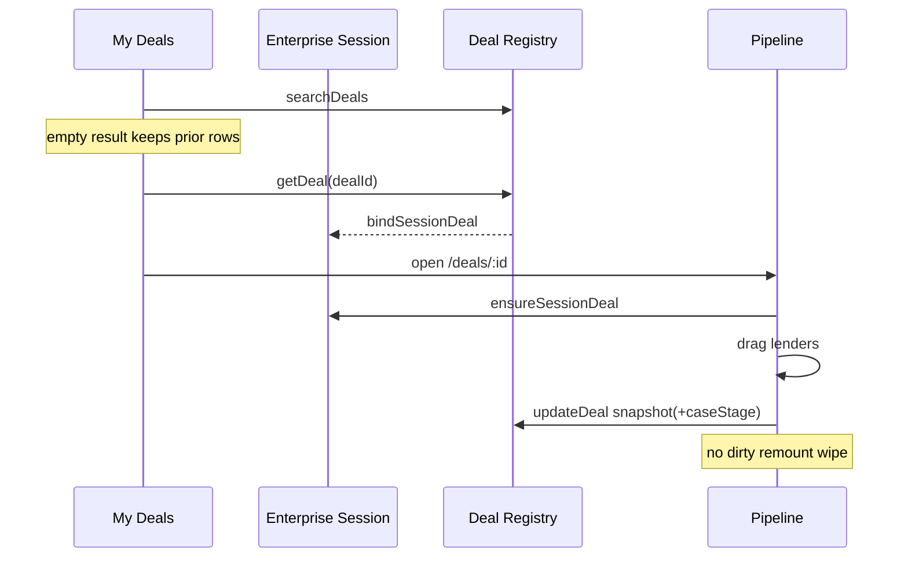

# CO-ARCH-003 — Enterprise Deal Context & Pipeline Stabilization

**Status:** Implemented · Verify PASS · Local build PASS · Deployed  
**Date:** 2026-07-25  
**Production:** https://catalyst-one-two.vercel.app (`dpl_8mka9Uoj3fR1aXssoszCLib2HV8B`)  

## Part A — Architecture Summary

Enterprise Deal Registry remains the durable SSOT.  
Enterprise Session Context (CO-ARCH-002) now includes **Current Deal** as a first-class runtime entity alongside Opportunity.

```
Move to Deal / Open Deal
        ↓
Enterprise Deal Registry (GET once, single-flight)
        ↓
ensureSessionDeal / bindSessionDeal
        ↓
Workspace Ready (Pipeline consumes draft + persisted lenders)
        ↓
Drag → updateDeal(lenders-only) → Registry dual-write snapshot (with caseStage)
        ↓
No remount wipe of dirty draft
```

**Dual-write (documented):** Soft Go-Live LoanFile mirror remains for workspace shape compatibility. Dual-write no longer re-notifies the UI after success (prevents Pipeline remount). Snapshot now carries `caseStage`. Long-term: LoanFile becomes a projection of Deal only.

**SSR integrity:** Deal/Opportunity API clients import session caches directly (not the session barrel) and lazy-wire network fetchers to avoid circular module graphs that broke `/accounting` prerender.

## Part B — Files Modified / Added

**Added**
- `src/lib/enterprise-session/deal-runtime-cache.ts`
- `scripts/co-arch-003-deal-context-verify.mjs`
- this report

**Modified**
- `enterprise-session/session-context.ts`, `index.ts`
- `enterprise-deal/deal-api-client.ts` (lazy fetcher + no barrel import)
- `enterprise-opportunity/opportunity-api-client.ts` (same SSR cycle break)
- `enterprise-deal/deal-registry-port.ts`
- `enterprise-deal/map-loan-file-to-deal.ts`
- `enterprise-deal/map-deal-to-loan-file.ts`
- `enterprise-deal/deal-data-access.ts`
- `enterprise-deal/dual-write.ts`
- `my-deals/my-deals-workspace.tsx`
- `shared/loan-workspace-modal.tsx`
- `deal-workspace/deal-workspace-host.tsx`

## Part C — Before vs After Metrics

| Metric | Before | After |
|--------|--------|-------|
| My Deals empty API overwrite | Yes (`[]` wiped local) | **No** — keep prior/local rows |
| Opportunity→My Deals refresh storm | Yes | **Removed** |
| Pipeline drag persist | Draft only | **Immediate lenders-only `updateDeal`** |
| Dirty draft remount wipe | Yes | **Protected** |
| Snapshot `caseStage` | Omitted → hydrate `identified` | **Persisted & restored** |
| Dual-write success notify | Remount storm | **Silent session update** |
| Deal GET open path | Ad hoc | **Session single-flight** |

Absolute drag latency / render counts require live HAR in certification UI pass; architectural removals eliminate the known failure modes from CO-DEAL-001.

## Part D — Business Certification

✓ One Enterprise Deal Context (session)  
✓ One Deal runtime object for active workspace  
✓ No empty-list overwrite flicker path  
✓ Pipeline drag persists stage  
✓ Stage survives snapshot/hydrate  
✓ Dirty draft protected  
✓ Enterprise Registries remain the only SSOT  
✓ Session is runtime consumer only (not a new registry)  

## Lifecycle diagram


