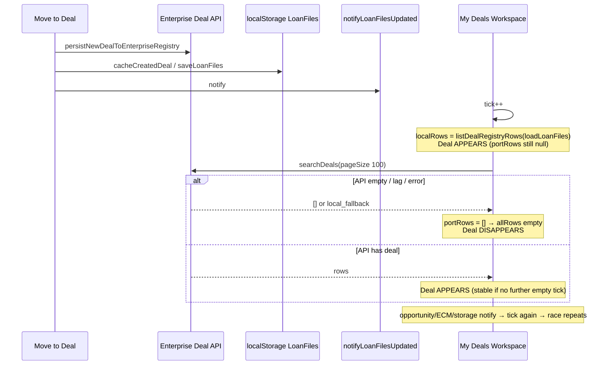
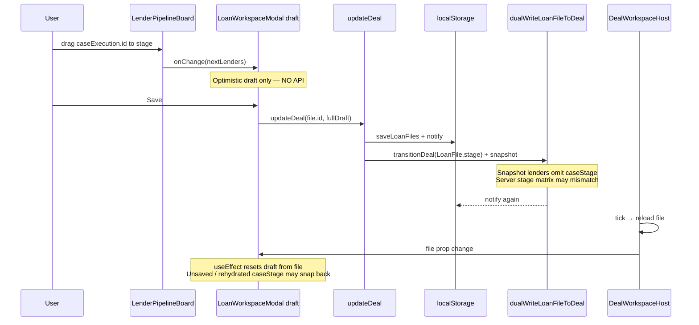

# CO-DEAL-001 — Deal & Lender Pipeline State Integrity Investigation

**Type:** Architectural investigation only (no implementation)  
**Date:** 2026-07-25  
**Status:** Blueprint for Deal Integrity / Pipeline Stabilization Sprint  

---

## Executive verdict

Two related but distinct defects share one architectural theme: **competing Deal state stores without a single session Deal SSOT consumer**.

| Symptom | Primary root cause |
|---------|-------------------|
| My Deals appear → disappear → appear | Dual list SSOT: `portRows ?? localRows` — empty/stale Enterprise API result overwrites local flash |
| Kanban drag errors / hang / inconsistent UI | Drag is **optimistic draft only**; persist is Save; notify/hydrate remounts wipe draft; Deal snapshot **drops `caseStage`** |

CO-ARCH-002 Enterprise Session Context holds Opportunity (+ optional `dealId` pointer). **My Deals and Lender Pipeline do not consume a canonical Deal session object.** They compete between localStorage LoanFiles, Enterprise Deal API, and React draft.

---

# Part A — Runtime sequence diagrams

## A.1 Move to Deal → My Deals



## A.2 Deal Workspace → Kanban drag → Save



## A.3 Identity chain (canonical vs competing)

```
Opportunity.id (Registry)
    ↓ Move to Deal
Enterprise Deal.id + dealNumber
    ↓ attach / cache
LoanFile.id (legacy)  ←── often Soft Go-Live SSOT for board
    ↓ lenders[]
LoanLenderExecution.id (case card id)
    ↓ drag
caseStage update (draft)
    ↓ Save
localStorage lenders[].caseStage
    ↓ dual-write snapshot (lossy)
Enterprise Deal.snapshot.lenders { id, name, status }  ← NO caseStage
    ↓ hydrate when local empty
projected lenders caseStage = "identified"  ← RESET
```

---

# Part B — Root cause analysis

### RC-1 — My Deals dual-source handoff (`portRows ?? localRows`)

- **Why:** `null` means “use local”; `[]` means “enterprise said empty” and **wins** over local.  
- **Where:** `my-deals-workspace.tsx` — `allRows = portRows ?? localRows`  
- **Impact:** Classic appear → disappear → appear while create/search settles or API briefly empty.  
- **Amplifiers:** tick on every `subscribeLoanFilesUpdated` + `subscribeOpportunitiesUpdated` + ECM version + `storage`.

### RC-2 — Tick storm / unnecessary Deal list reloads

- **Why:** Opportunity updates and DAL `loadDeals()` success notify loan-files bus → My Deals re-runs `searchDeals`.  
- **Where:** `loan-data-sync.ts`, `opportunity-data-sync.ts`, `deal-data-access.ts`, `my-deals-workspace.tsx`  
- **Impact:** More chances to land on empty/stale responses; list thrash.

### RC-3 — Kanban drag does not persist

- **Why:** Drop only patches React draft via `patch({ lenders })`.  
- **Where:** `lender-pipeline-board.tsx` → `loan-workspace-modal.tsx`  
- **Impact:** Any remount/notify before Save snaps card back; feels like hang/inconsistent UI.

### RC-4 — Draft remount on `file` prop / tick

- **Why:** `DealWorkspaceHost` re-resolves file on notify; modal `useEffect([file])` resets draft.  
- **Where:** `deal-workspace-host.tsx`, `loan-workspace-modal.tsx`  
- **Impact:** Mid-drag or post-drag unsaved moves discarded; board jumps.

### RC-5 — Deal snapshot omits lender `caseStage`

- **Why:** `buildLoanFileDealSnapshot` stores thin lender objects; `projectLendersFromDeal` defaults `caseStage: "identified"`.  
- **Where:** `map-loan-file-to-deal.ts`, `map-deal-to-loan-file.ts`  
- **Impact:** After Soft Go-Live wipe / enterprise-primary hydrate, pipeline resets to Identified.

### RC-6 — Dual-write stage taxonomy mismatch

- **Why:** Dual-write transitions Deal using **LoanFile.stage** (gross/opportunity taxonomy); server validates **lender case stages**.  
- **Where:** `dual-write.ts`, `deal-stage-rules.ts`  
- **Impact:** Runtime validation errors; registry drift; perceived pipeline failure after Save.

### RC-7 — Full Save triggers Business Completion gate

- **Why:** Lenders-only patches skip completion; full Save spreads entire draft → completion required.  
- **Where:** `loan-files-utils.ts`, `business-completion/loan-mapper.ts`, `persistDraft`  
- **Impact:** Dialog / “hang” after drag+Save when LoanFile incomplete.

### RC-8 — Deal id vs LoanFile id confusion on hydrate

- **Why:** Stub may use `deal.id` when `legacyLoanFileId` missing → `updateDeal` misses local row.  
- **Where:** `map-deal-to-loan-file.ts`, `resolve-deal-file.ts`, `updateDeal`  
- **Impact:** Save appears ok / returns null; spinner or inconsistent workspace.

### RC-9 — Session Context gap (CO-ARCH-002)

- **Why:** Session caches Opportunity + `dealId` pointer; **no Deal record cache / no My Deals or Pipeline consumer**.  
- **Where:** `enterprise-session/session-context.ts`  
- **Impact:** Modules keep independent Deal copies (localStorage vs API vs draft) — violates “one active Deal context” intent.

### RC-10 — Secondary My Deals hide (scope/RM)

- **Why:** `my_deals` scope filters by RM name mismatch.  
- **Where:** My Deals filters / `resolveCurrentRmName`  
- **Impact:** Deal “vanishes” without source going empty (looks like flicker).

---

# Part C — Files responsible

| Area | Files |
|------|-------|
| My Deals UI / dual SSOT | `my-deals-workspace.tsx`, `deal-registry-table.tsx`, `lib/my-deals/deal-registry.ts` |
| Deal list port | `lib/enterprise-deal/deal-registry-port.ts`, `enterprise-deal` API client |
| Notify bus | `loan-data-sync.ts`, `opportunity-data-sync.ts` |
| Local Soft Go-Live | `loan-files-storage.ts`, `loan-files-utils.ts` |
| DAL / dual-write | `deal-data-access.ts`, `dual-write.ts` |
| Snapshot lossy map | `map-loan-file-to-deal.ts`, `map-deal-to-loan-file.ts` |
| Pipeline Kanban | `execution/lender-pipeline-board.tsx` |
| Draft / Save | `shared/loan-workspace-modal.tsx` |
| Deal route host | `deal-workspace/deal-workspace-host.tsx` |
| Stage rules | `server/services/enterprise-deal/deal-stage-rules.ts` |
| Session (Opportunity only) | `enterprise-session/*` |
| Move to Deal / sync | `move-to-deal.ts`, `strategic-lender-pipeline/sync.ts` |

---

# Part D — Recommended implementation plan

## Principles

1. **Enterprise Deal Registry** is durable SSOT for Deals (when Prisma mode).  
2. **Enterprise Session** holds the **active Deal record** (not a second registry) — same pattern as Opportunity.  
3. Pipeline stage lives on **lender case** with durable persistence of `caseStage`.  
4. UI never commits empty Enterprise list over known-good local without explicit “confirmed empty”.  
5. Drag either auto-persists case stage or dirty draft is protected from remount wipe.

---

## Phase 1 — My Deals list integrity (P0)

1. Replace `portRows ?? localRows` with **merge / prefer non-empty enterprise**, or keep showing previous good rows until API returns success with intentional empty.  
2. Do **not** treat `[]` as authoritative over local during create lag (short grace / ETag / “pending create” ids).  
3. Unsubscribe My Deals from Opportunity notify for full Deal reload (or debounce heavily).  
4. Single-flight `searchDeals` (same as Opportunity session cache pattern).

**Exit:** No appear/disappear cycle after Move to Deal.

## Phase 2 — Lender case stage durability (P0)

1. Include `caseStage` (and stable case id) in Deal snapshot / API fields.  
2. `projectLendersFromDeal` must restore real `caseStage`, never hardcode `identified`.  
3. Align dual-write transition with **lender case stage** matrix (or stop transitioning Deal grossStage from LoanFile.stage on lender moves).  
4. On drag: persist lender-only patch immediately **or** mark draft dirty and block `file` prop reset while dirty.

**Exit:** Drag → Save (or auto-save) survives reload; no snap-back to Identified.

## Phase 3 — Deal Session Context (P0/P1)

1. Extend Enterprise Session: `ensureSessionDeal(dealId)` cache-first + single-flight (mirror Opportunity).  
2. Deal Workspace + Pipeline consume session Deal; My Deals open binds session Deal.  
3. `bindSessionDeal` after Move to Deal / open.  
4. Invalidate on Deal update/delete only.

**Exit:** Zero competing independent Deal copies for the active workspace.

## Phase 4 — Pipeline UX integrity (P1)

1. Separate “lender case stage save” from full LoanFile Business Completion Save.  
2. Protect modal draft: don’t `setDraft(file)` when dirty unless forced refresh.  
3. Clear error surfacing for stage matrix / invoice party (no silent dual-write fail).  
4. Stabilize Deal id ↔ LoanFile id mapping (always prefer legacyLoanFileId; never flip mid-session).

## Phase 5 — Certification

- HAR: My Deals list after Move to Deal stays visible for 30s with no empty flash.  
- Drag across 3 stages → reload page → stages preserved.  
- No uncaught runtime errors on drop.  
- Dual-write success with matching caseStage in Registry.

---

## Suggested tickets

| ID | Title | Priority |
|----|-------|----------|
| CO-DEAL-002 | Fix My Deals dual-SSOT empty overwrite | P0 |
| CO-DEAL-003 | Persist lender caseStage in Deal snapshot / hydrate | P0 |
| CO-DEAL-004 | Protect Pipeline draft from notify remount | P0 |
| CO-DEAL-005 | Align dual-write stage taxonomy with lender cases | P0 |
| CO-DEAL-006 | Enterprise Session Deal cache (ensureSessionDeal) | P1 |
| CO-DEAL-007 | Lender-only stage save vs full completion gate | P1 |
| CO-DEAL-008 | Deal↔LoanFile id continuity certification | P1 |

---

## Explicitly out of scope

- Implementation / patches in this task  
- Cosmetic loading indicators  

**Next step:** Approve CO-DEAL-002–005 as the Deal Integrity Stabilization Sprint.
