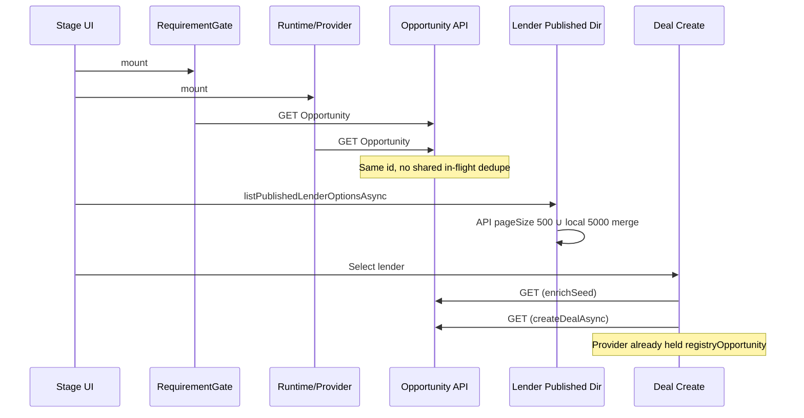

# CO-PERF-001 — Enterprise Performance & Context Integrity Audit

**Type:** Architectural investigation (no implementation)  
**Date:** 2026-07-25  
**Status:** Blueprint for Enterprise Performance Optimization Sprint  
**Scope:** Dashboard → My Opportunities → Opportunity Workspace → Document Requests → Credit Workbench → LIFE → Manual Select → Move to Deal → Deal → Pipeline  

---

## Executive verdict

Slowness and “Opportunity not found” after Select are the same architectural class of defect:

1. **Opportunity is treated as a network resource, not a session context.**  
   `getOpportunity` always hits the API. The in-memory `opportunityRecordCache` is write-through only — never read by the client GET path.

2. **Every journey stage remounts its own loader** (requirement gate ∥ runtime ∥ `OpportunityWorkspaceProvider`), so the same Opportunity is fetched **many times** before the user clicks Select.

3. **Business actions re-validate Registry again** (Select: up to 2× GET; Move to Deal: +1× GET + full lender directory), even when LIFE already holds `registryOpportunity`.

4. **Lender published directory has no session cache** — every Manual search and Move-to-Deal re-merges API + Soft Go-Live (pageSize 500 / 5000).

5. **React Query exists but is unused for registries** — refresh is CustomEvent + `refreshKey` cascades that recompute large workspace trees.

Cosmetic loading spinners will not fix this. The fix is **One Opportunity Context + shared Registry caches + zero redundant validation**.

---

# PART A — Performance Report

## A.1 Measurement method

This audit is **code-derived** (call graphs + known pageSizes). Absolute ms require a dedicated RUM/Puppeteer pass in the Optimization Sprint. Relative cost bands assume ~150–400 ms per authenticated Opportunity GET on prod (typical Vercel → Postgres).

## A.2 Happy-path waterfall (first visit, every stage once)

```
t0  My Opportunities mount
    └─ GET searchOpportunities(limit=100)                    [list]

t1  Open Opportunity → Credit Bench
    ├─ GET getOpportunity (useRequirementCapturedGate)       [dup #1]
    └─ GET getOpportunity (loadOpportunityJourneyRuntime)    [dup #2]  ∥ parallel

t2  Document Requests tab
    └─ GET getOpportunity (new OpportunityWorkspaceProvider) [dup #3]
    └─ loadDeals (parallel)

t3  Credit Workbench
    ├─ GET getOpportunity (gate)                             [dup #4]
    └─ GET getOpportunity (runtime)                          [dup #5]  ∥

t4  LIFE (/opportunities)
    ├─ GET getOpportunity (gate)                             [dup #6]
    └─ GET getOpportunity (OpportunityWorkspaceProvider)     [dup #7]  ∥
    └─ loadDeals
    └─ listPublishedLenderOptionsAsync (API∪local)           [lender]

t5  Manual Select (first lender, no Deal yet)
    ├─ GET getOpportunity (enrichSeedFromOpportunityRegistry)[dup #8]
    └─ GET getOpportunity (createDealAsync)                  [dup #9]  sequential
    └─ shortlist local + syncShortlistToIdentified

t6  Move to Deal
    ├─ GET getOpportunity                                    [dup #10]
    └─ listPublishedLenderOptionsAsync (full)                [lender again]
    └─ ensureLoanWorkspace (usually 0 GET if Select created attachment)
    └─ persist deals / markConvertedToDeal
```

### Estimated Opportunity GET count (one journey)

| Segment | GETs |
|---------|-----:|
| List open | 0 |
| Credit Bench | 2 |
| Document Requests | +1 |
| Credit Workbench | +2 |
| LIFE | +2 |
| First Manual Select | +2 |
| Move to Deal | +1 |
| **Total** | **~10** |

With ~200–300 ms median GET: **~2–3 s of Opportunity network alone**, before UI work, lender merges, or Deal writes — on a tiny dataset.

## A.3 Page load / TTI (qualitative)

| Surface | Blocking before interactive |
|---------|-----------------------------|
| My Opportunities | 1 list search; re-runs on window focus |
| Credit Bench / LIFE | Dual parallel Opportunity GETs (gate + provider/runtime) before chrome is trustworthy |
| LIFE Manual column | Waits on lender API∪local merge (500 + Soft Go-Live up to 5000) |
| Document Requests | Remounts full Registry gate even if Credit Bench already loaded the same id |

**UI can paint chrome early while Registry/Deal context is still settling** (historical soft-open is gated by CO-OPP-SSOT-001 on LIFE, but sibling stages still dual-fetch).

## A.4 Duplicate / sequential / parallel

| Pattern | Where | Impact |
|---------|-------|--------|
| Parallel duplicate GET | Gate ∥ runtime/provider on every stage | 2× latency floor per stage |
| Sequential duplicate GET | Select: enrich then createDealAsync | +2 RTT after user click |
| Repeated lender merge | LIFE search + Move to Deal | Heavy identity merge, no TTL cache |
| Focus re-search | My Opportunities | Extra list traffic on tab return |
| refreshKey cascade | Opportunity workspace | Broad recompute of intelligence/docs/tasks/LIFE |

## A.5 Rendering bottlenecks (architectural)

- `opportunity-workspace-context.tsx`: many `useMemo`/`useEffect` tied to `refreshKey` + `loanFilesVersion` + ECM version → one notify rebuilds most panels.
- LIFE strategy board: Manual column effect depends on search debounce + competition tick; Chanakya `useMemo` derives on every refresh.
- No React Query → no request dedupe / stale-while-revalidate for Registry GETs.
- Soft Go-Live lender bootstrap (`ensureLenderMasterBootstrapped`) can run on published-list reads.

## A.6 Waterfall diagram (logical)



---

# PART B — Context Integrity Report

## B.1 Opportunity lifecycle (as implemented today)

| Step | Object identity | Source |
|------|-----------------|--------|
| My Opportunities row | Registry list row id | API search |
| Session remember | `ActiveOpportunityContext.opportunityId` | sessionStorage helpers |
| Credit Bench / LIFE open | Fresh API record | `getOpportunity` (again) |
| Provider state | `registryOpportunity` React state | After CO-OPP-SSOT-001 success |
| Module Map cache | `opportunityRecordCache` | Written on GET; **not read by GET** |
| Runtime projection | `LoanFileOpportunityView` | Derived from Registry + ECM |
| Select / Move to Deal | Re-fetch API record | Ignores provider object |

**Canonical rule violated:** “load once, consume everywhere.”

## B.2 How many Opportunity objects / IDs

For one business case:

- **1** Enterprise Opportunity UUID (correct SSOT id)  
- **N** in-memory copies: list row, session context, provider state, Map cache, enrich response, createDealAsync response  
- **0–1** Deal/LoanFile attachment linked by `enterpriseOpportunityId`  
- EOLE in-memory opportunity may still exist for demos but is **no longer operational SSOT** on LIFE (CO-OPP-SSOT-001)

Fallback identities (URL-only, EOLE code-as-number) were removed from LIFE operational ready-state; **re-fetch failure** after ready still surfaces as “Opportunity not found” on Select if subsequent GETs 404 (org/session/persistence).

## B.3 Registry usage summary

| Registry | Loaded once? | Cached? | Shared? | Reused by actions? |
|----------|--------------|---------|---------|-------------------|
| Opportunity | ❌ per stage / action | Write-through Map only | Partially (sync peek) | ❌ actions re-GET |
| Lender (published) | ❌ per search / Move to Deal | Soft Go-Live localStorage; no async TTL | Dual-merge each call | ❌ |
| Contact (ECM) | Hydrate once/session (ideal) | In-memory ports | ✅ sync find | ✅ after hydrate |
| Product | Constants / Tier-2 Maps | Server Maps / UI seeds | Mostly ✅ | Low browser cost |
| Document instances | localStorage per call | localStorage | Yes | Re-read on subscribe |
| Document types | Tier-2 / constants | Maps | Mostly ✅ | Low |

## B.4 Repeated validation

| Action | Re-validates Opportunity? |
|--------|---------------------------|
| Stage mount (gate) | Yes — GET |
| Provider mount | Yes — GET |
| Manual Select | Yes — up to 2× GET |
| Move to Deal | Yes — ≥1× GET |
| Deal Workspace open | No Opportunity GET (Deal/LoanFile path) |

## B.5 Why UI feels “ready” while context is incomplete

- Parallel loaders finish at different times; chrome can render with partial contact/product while second GET or Deal hydrate continues.
- Lender Manual column can show results from Soft Go-Live while Prisma side is still merging.
- Historical soft-open (pre-CO-OPP-SSOT-001) trained the UX; residual sibling stages still race gate vs runtime.

---

# PART C — Root Cause Analysis

### RC-1 — `getOpportunity` never reads session cache

- **Why:** Client always `opportunityFetch` then `cacheOpportunityRecord`; cache is for sync projection fallback only.  
- **Where:** `src/lib/enterprise-opportunity/opportunity-api-client.ts` (`getOpportunity`)  
- **Impact:** Every consumer pays full RTT; Select/Move-to-Deal ignore already-loaded provider state.  
- **Files:** `opportunity-api-client.ts`, `opportunity-runtime-adapter.ts`

### RC-2 — Duplicate loaders per stage (gate ∥ runtime/provider)

- **Why:** ADR requirement gate and journey runtime/provider independently resolve the same id.  
- **Where:** `use-requirement-captured-gate.ts` + `loadOpportunityJourneyRuntime` / `OpportunityWorkspaceProvider`  
- **Impact:** 2× Opportunity GET on Credit Bench, Credit Workbench, LIFE.  
- **Files:** `use-requirement-captured-gate.ts`, credit-bench / credit-workbench / opportunities pages, `opportunity-workspace-context.tsx`

### RC-3 — Provider remount on Document Requests

- **Why:** `CreditBenchDocumentRequestsHost` creates a **new** `OpportunityWorkspaceProvider` instead of consuming parent journey context.  
- **Where:** `credit-bench-document-requests-host.tsx`  
- **Impact:** Extra Registry GET + Deal load on every Documents section enter.  
- **Files:** `credit-bench-document-requests-host.tsx`, `opportunity-workspace-context.tsx`

### RC-4 — Select double-GET on Deal create

- **Why:** `enrichSeedFromOpportunityRegistry` GET, then `createDealAsync` GET again for the same `existingOpportunityId`. Provider already has the record.  
- **Where:** `ensure-loan-workspace.ts`, `deal-data-access.ts`  
- **Impact:** Click latency; “Opportunity not found” if second GET fails while UI already showed ready.  
- **Files:** `ensure-loan-workspace.ts`, `deal-data-access.ts`, `workspace-life-strategy-board.tsx`

### RC-5 — Move to Deal re-fetches Opportunity + full lender directory

- **Why:** Transition orchestrator treats Registry as remote source of truth every time.  
- **Where:** `move-to-deal.ts`  
- **Impact:** Extra RTT + expensive lender merge after user already selected from published list.  
- **Files:** `move-to-deal.ts`, `published-directory.ts`

### RC-6 — Lender published directory has no shared async cache

- **Why:** Each call merges API (pageSize 500) + Soft Go-Live (up to 5000) with identity logic.  
- **Where:** `published-directory.ts`  
- **Impact:** Sluggish Manual search / Move to Deal even with small Prisma sets (Soft Go-Live catalog ~84+).  
- **Files:** `published-directory.ts`, `local-store.ts`, `bootstrap-master.ts`

### RC-7 — Chanakya still Soft Go-Live-only for lenders (related integrity)

- **Why:** `listPublishedLenderOptions()` sync path.  
- **Where:** `recommend-from-registry.ts`  
- **Impact:** Manual vs Chanakya can diverge; not primary latency but SSOT skew.  
- **Files:** `recommend-from-registry.ts`, `published-directory.ts`

### RC-8 — `refreshKey` / CustomEvent fan-out

- **Why:** `subscribeOpportunitiesUpdated` / loan-file updates bump keys that recompute intelligence, docs, tasks, LIFE.  
- **Where:** `opportunity-workspace-context.tsx`, panel components  
- **Impact:** Perceived jank after any notify; not necessarily more API, but expensive React work.  
- **Files:** `opportunity-data-sync.ts`, `loan-data-sync.ts`, workspace panels

### RC-9 — React Query unused for registries

- **Why:** Registries use custom clients + Maps/localStorage.  
- **Where:** `query-provider.tsx` present; registries bypass it  
- **Impact:** No in-flight dedupe, no stale-while-revalidate, no shared observer cache.  

### RC-10 — My Opportunities re-search on focus

- **Why:** Focus listener + subscribe tick.  
- **Where:** `my-opportunities-workspace.tsx`  
- **Impact:** List churn when switching tabs; contributes to “slow Opportunity pages.”  

---

# PART D — Refactoring Plan (Optimization Sprint blueprint)

## Principles (non-negotiable)

1. **One Opportunity Context** per browser session journey (`opportunityId` → single immutable Registry record holder).  
2. **One Registry Lookup** on open; subsequent consumers read context/cache.  
3. **One Registry Cache** with TTL + in-flight dedupe (React Query or equivalent).  
4. **Business actions never re-GET** an Opportunity already present and non-stale in active workspace.  
5. **Shared providers** across Document Requests / LIFE / Credit — do not remount Registry gates.

---

## Phase 0 — Instrumentation (1–2 days)

- Add RUM markers: TTI, Opportunity GET count, lender merge duration, Select click → queue.  
- Puppeteer journey script with network HAR waterfall.  
- Success criteria: baseline numbers for Phase 1 comparison.

## Phase 1 — Opportunity Context Hub (P0)

**Goal:** Load Opportunity once; share everywhere.

1. Introduce `ActiveOpportunityRegistryStore` (or React Query key `opportunity:{id}`):  
   - `ensureOpportunity(id)` — single-flight GET  
   - `getOpportunityCached(id)` — sync read  
   - Invalidate only on mutate / explicit refresh  
2. Change `enterpriseOpportunityApiClient.getOpportunity` to use single-flight + cache-first (stale-while-revalidate optional).  
3. Wire `useRequirementCapturedGate`, `OpportunityWorkspaceProvider`, `loadOpportunityJourneyRuntime` to **the same** `ensureOpportunity`.  
4. Pass `registryOpportunity` into `ensureLoanWorkspace` / `createDealAsync` / `moveOpportunityToDeal` — **no GET when record provided**.  
5. Document Requests: consume parent context; remove nested provider remount (or pass `registryOpportunity` as prop).

**Exit:** Open → LIFE → Select → Move to Deal = **1 Opportunity GET** (plus mutations only).

## Phase 2 — Lender Published Directory Cache (P0)

1. Session cache for `listPublishedLenderOptionsAsync` (TTL 60–300s; invalidate on lender-registry-updated).  
2. Chanakya uses same async published cache (eliminate Soft Go-Live-only ranking).  
3. Move to Deal reuses last Manual Selection resolve set / cache — do not re-merge full universe unless cache miss.  
4. Long-term: Soft Go-Live bootstrap only when API unavailable (not dual-merge every keystroke).

**Exit:** Manual search debounce hits memory; Move to Deal ≤1 lender read (cache hit).

## Phase 3 — Journey Provider Topology (P1)

1. Single `OpportunityJourneyProvider` above Credit Bench → Documents → Credit Workbench → LIFE hops (or lift store outside route remounts).  
2. Stage routes read store by `opportunityId` from URL; do not re-bootstrap Registry.  
3. Collapse gate + provider into one effect.

**Exit:** Stage navigation = 0 Opportunity GETs when store warm.

## Phase 4 — React / notify hygiene (P1)

1. Narrow `refreshKey` — panel-specific versions instead of global bump.  
2. Prefer React Query observers over CustomEvent fan-out where possible.  
3. Remove My Opportunities focus full re-search or debounce heavily.

**Exit:** Notify after Select does not re-render entire workspace tree.

## Phase 5 — Contact / Product / Document alignment (P2)

1. Ensure ECM hydrate once per session at app shell (already close).  
2. Document instance list: memoize by opportunityId; avoid full localStorage parse per panel.  
3. Product Tier-2: confirm server Maps hydrated once; no browser dual-fetch.

## Phase 6 — Certification

- Repeat CO-PERF-001 waterfall: Opportunity GET count ≤ 1 per open; Select GET = 0; Move to Deal Opportunity GET = 0 when context warm.  
- TTI budget (propose): LIFE interactive &lt; 1.5 s on warm session; Select click → queue toast &lt; 300 ms local work.  
- SSOT checklist: Opportunity / Lender / Contact / Product / Document — one cache owner each.

---

## Suggested sprint backlog (tickets)

| ID | Title | Priority |
|----|-------|----------|
| CO-PERF-002 | Opportunity single-flight cache + cache-first GET | P0 |
| CO-PERF-003 | Pass registryOpportunity into Deal create / Move to Deal | P0 |
| CO-PERF-004 | Lender published directory session cache | P0 |
| CO-PERF-005 | Unify gate + provider loaders | P0 |
| CO-PERF-006 | Remove Document Requests provider remount | P1 |
| CO-PERF-007 | Chanakya async published lenders | P1 |
| CO-PERF-008 | Narrow refreshKey / React Query for registries | P1 |
| CO-PERF-009 | Perf certification HAR + budgets | P0 |

---

## Target architecture (after sprint)

```
Open Opportunity (URL id)
        ↓
ensureOpportunity(id)  ←── single-flight GET once
        ↓
ActiveOpportunityContext (React + module store)
        ↓
┌───────────────────────────────────────────┐
│ Documents │ Credit │ LIFE │ Select │ Deal │
│     all read same registryOpportunity     │
└───────────────────────────────────────────┘
        ↓
ensureDealAttachment(opportunity, lenders…)  ← no Opportunity GET
        ↓
Pipeline
```

---

## Explicitly out of scope for this document

- Implementation / patches  
- Cosmetic spinner changes  
- Hiding loading states  

**Next step:** Approve Phase 0–1 as CO-PERF Optimization Sprint kickoff.
