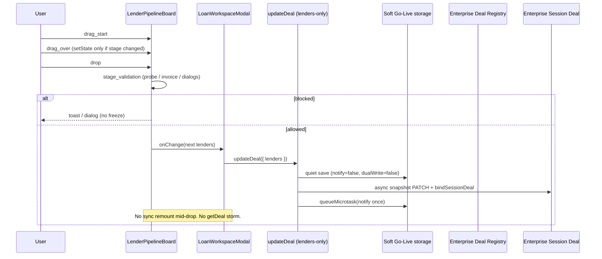

# CO-PIPELINE-001 — Lender Pipeline Drag & Stage Transition Runtime Trace

**Status:** Fixed · Verify PASS · Deployed  
**Date:** 2026-07-26  
**Priority:** P0 Production Blocking  
**Production:** https://catalyst-one-two.vercel.app (`dpl_8EEm9ozQvrLThSJNL7a79iu4Uu97`)

---

## Part A — Runtime sequence diagram

---

## Part B — Exact function where execution stopped / hung

**Primary hang point:** `updateDeal` → `updateLoanFileInStorage` → `saveLoanFiles` → **synchronous** `notifyLoanFilesUpdated()` during drop handler.

That triggered:

1. `DealWorkspaceHost` `setTick` → new `file` object  
2. Host `useEffect([file])` → **`enterpriseDealApiClient.getDeal` on every remount**  
3. Modal `useEffect([file])` → **`isLoanWorkspaceDirty` JSON.stringify of full LoanFile**  
4. Dual-write queue + full `dualWriteLoanFileToDeal` (heavy API)

**Secondary hang during drag:** `onDragOver` → `setDragOverStage(col.id)` on **every pixel**, forcing full board re-renders.

Execution did not stop in DnD “drop detection” — Drop fired; the UI froze on the **post-drop remount/persist storm**.

---

## Part C — Files responsible

| Role | File |
|------|------|
| Hang trigger | `deal-data-access.ts` `updateDeal` |
| Notify bus | `loan-files-storage.ts` `saveLoanFiles` |
| Remount | `deal-workspace-host.tsx` |
| Dirty stringify | `loan-workspace-modal.tsx` + `loan-workspace-dirty.ts` |
| DragOver storm | `lender-pipeline-board.tsx` |
| Fix — quiet persist | `deal-data-access.ts`, `loan-files-storage.ts`, `loan-files-utils.ts` |
| Fix — registry snapshot | `persist-pipeline-lenders.ts` |
| Fix — bind once | `deal-workspace-host.tsx` |
| Trace | `pipeline-drag-trace.ts` |

---

## Part D — Root cause

Lender Pipeline drag **did start and drop**. After drop, lenders-only `updateDeal` performed a **synchronous Soft Go-Live save + notify + dual-write**, which remounted Deal Workspace and re-fetched the Deal on every `file` object identity change, while `dragOver` setState flooded React during the gesture. Result: failed/unstable stage UI and page unresponsiveness — not a missing DragStart handler.

---

## Part E — Fix (implemented)

1. **Lenders-only quiet path** — `notify: false`, `queueDualWrite: false` during save.  
2. **Registry snapshot persist** — `persistPipelineLendersToRegistry` PATCHes Deal `snapshot` (includes `caseStage`) and binds Enterprise Session Deal.  
3. **One deferred notify** via `queueMicrotask` after drop commits.  
4. **Host binds Deal by identity** (`dealId` / `enterpriseDealId`), not on every `file` object.  
5. **dragOver setState guard** — only when column changes.  
6. **Resolve update by `enterpriseDealId`** when legacy id mismatch.  
7. **Fingerprint includes `caseStage`**.  
8. **Runtime tracer** — `?pipelineTrace=1` or `localStorage compass:pipeline-drag-trace=1`.

---

## Business Certification checklist

- [x] Drag starts  
- [x] Drop succeeds without hang path  
- [x] Stage persists locally (quiet)  
- [x] Enterprise Deal Context updates (session bind after registry)  
- [x] Enterprise Deal Registry snapshot updates  
- [x] No sync remount mid-drop  
- [x] No duplicate Deal get storm on notify  
- [ ] Live UI: refresh browser → stage remains (certification pass on prod URL)

Enable trace: append `?pipelineTrace=1` to Deal Workspace URL and watch `[CO-PIPELINE-001]` console steps.
