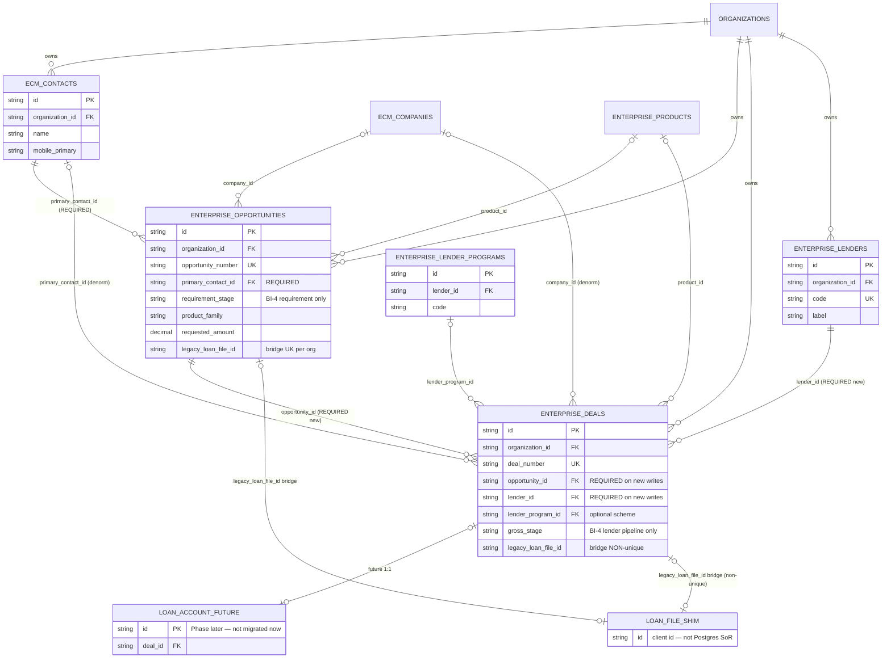

# CO-ARCH-003 Phase 2A — Proposed Entity Relationship Diagram (ERD)

**Status:** SUBMITTED — migration gate satisfied; structural work authorized after this artifact  
**Date:** 2026-07-24  
**Authority:** Phase 2A Approval & Implementation Authorization (Option A)  
**Constitution:** Contact → Opportunity → Deal (per lender) → Loan Account (future)

---

## 1. System of Record (SoR)

| Entity | SoR | Persistence | Notes |
|--------|-----|-------------|--------|
| **Contact** | ECM Contact Registry | `ecm_contacts` (Postgres) | Party root; unchanged |
| **Opportunity** | Opportunity Registry | `enterprise_opportunities` (Postgres) | Financial requirement; Lead = Opportunity |
| **Deal** | Deal Registry | `enterprise_deals` (Postgres, **redefined**) | **One row = one lender execution** (Option A) |
| **Lender** | Lender Registry | `enterprise_lenders` | Master; required on every new Deal |
| **Lender Program / Scheme** | Lender Program Registry | `enterprise_lender_programs` | Optional scheme on Deal |
| **Loan File** | **Not SoR** (transitional) | TypeScript + `localStorage` shim | Compatibility DTO / cache only |
| **Loan Account** | Future | *Not created in Phase 2A* | Reserved 1:1 (or 1:N) under Deal after disbursement |
| **Counterparty Assignment** | Deprecated as lender-case SoR | `enterprise_deal_counterparty_assignments` | Retained for history; lending pipeline SoR moves to Deal |

---

## 2. Cardinalities (constitutional)

```text
Organization 1 ── * Contact
Contact        1 ── * Opportunity
Opportunity    1 ── * Deal          (BI-1: zero Deals allowed)
Deal           * ── 1 Opportunity   (BI-2: exactly one)
Deal           * ── 1 Lender        (BI-3: required for new Deals)
Deal           * ── 0..1 LenderProgram
Deal           1 ── 0..1 LoanAccount (future)
Opportunity    0..1 ── 1 LoanFile   (bridge via legacy_loan_file_id; LoanFile not SoR)
Deal           * ── 0..1 LoanFile   (bridge only; multiple Deals may share same legacy id)
```

**Forbidden:** Deal → many Opportunities · Deal without Opportunity · Deal without Lender (new writes).

---

## 3. Mermaid ERD (proposed)



---

## 4. Relationship direction & foreign keys

| FK column | From | To | Nullability (Phase 2A) | ON DELETE | Enforced |
|-----------|------|-----|------------------------|-----------|----------|
| `primary_contact_id` | Opportunity | `ecm_contacts.id` | **NOT NULL** | RESTRICT | DB + API |
| `company_id` | Opportunity | `ecm_companies.id` | NULL | RESTRICT | DB |
| `product_id` | Opportunity | `enterprise_products.id` | NULL | RESTRICT | DB |
| `opportunity_id` | Deal | `enterprise_opportunities.id` | NULL during backfill; **required on API create** | RESTRICT | API now; DB NOT NULL after backfill certify (optional later wave) |
| `lender_id` | Deal | `enterprise_lenders.id` | NULL during backfill; **required on API create** | RESTRICT | API now |
| `lender_program_id` | Deal | `enterprise_lender_programs.id` | NULL | RESTRICT | DB |
| `primary_contact_id` | Deal | `ecm_contacts.id` | NULL (denorm) | RESTRICT | DB |
| `legacy_loan_file_id` | Opportunity | (LoanFile client id) | NULL | — | Unique `(org, legacy)` when set |
| `legacy_loan_file_id` | Deal | (LoanFile client id) | NULL | — | **Index only** (unique dropped — multi-Deal per LoanFile) |

**Partial unique (active lender Deal):**  
`(organization_id, opportunity_id, lender_id)` WHERE `is_deleted = false` AND both FKs NOT NULL — prevents duplicate active Deals for same lender on same Opportunity.

---

## 5. Primary keys & business numbers

| Entity | PK | Business number | Allocator |
|--------|----|-----------------|-----------|
| Contact | `id` (cuid) | ECM mobile uniqueness per org | ECM |
| Opportunity | `id` (cuid) | `OPP-YYYY-######` | `enterprise_opportunity_number_sequences` |
| Deal | `id` (cuid) | `DEAL-YYYY-######` | `enterprise_deal_number_sequences` (existing) |
| Lender | `id` (cuid) | `code` (LND…) | Lender Registry |
| Loan Account (future) | `id` | TBD | Future |

**IDs are independent:** Opportunity id/number ≠ Deal id/number.

---

## 6. Field ownership (BI-4)

| On Opportunity only | On Deal only |
|---------------------|--------------|
| Requirement stage / sub-stage | Lender pipeline stage / sub-stage |
| Requested amount (requirement) | Sanction / approved / fulfilled (lender) |
| Fulfilment mode / rollup status | Login, approval, disbursement, payout |
| Product requirement | Lender + scheme |
| Shared customer requirement docs (later) | Bank pack / conditions (later) |

---

## 7. Loan File & Loan Account (explicit)

### Loan File (retained, not SoR)

- Remains a **compatibility projection** for existing workspaces.
- Bridge: `enterprise_opportunities.legacy_loan_file_id` (1 Opportunity ↔ 1 LoanFile id).
- Multiple Deals may share the same `legacy_loan_file_id` (non-unique on Deal).
- Writes that create a requirement must create **Opportunity**; writes that assign a lender must create **Deal**.

### Loan Account (future — ERD only)

```text
Deal 1 ── 0..1 Loan Account   (after disbursement)
```

No Prisma model or migration in Phase 2A.

---

## 8. Example instance (Option A)

```text
Contact: Rahul Sharma
  └── Opportunity OPP-2026-000045  (₹2 Cr Home Loan, requirement stage)
        ├── Deal DEAL-2026-000101  lender=HDFC
        ├── Deal DEAL-2026-000102  lender=ICICI
        └── Deal DEAL-2026-000103  lender=SBI
```

---

## 9. Migration implications (non-destructive)

1. **Additive:** create Opportunity tables + sequences.  
2. **Additive:** add `opportunity_id`, `lender_id`, `lender_program_id` to `enterprise_deals`.  
3. **Constraint change (safe):** drop unique `(org, legacy_loan_file_id)` on Deals → non-unique index.  
4. **Backfill:** each legacy engagement Deal → Opportunity; primary lender → same Deal linked; additional counterparties → **new Deal rows**; no-lender engagement → Opportunity only + soft-delete engagement Deal.  
5. **No drops** of Deal child tables; no Loan Account table yet.

---

## 10. Gate statement

This ERD is the proposed schema contract for Phase 2A.  
**Prisma migrations and code changes proceed next per authorization.**
