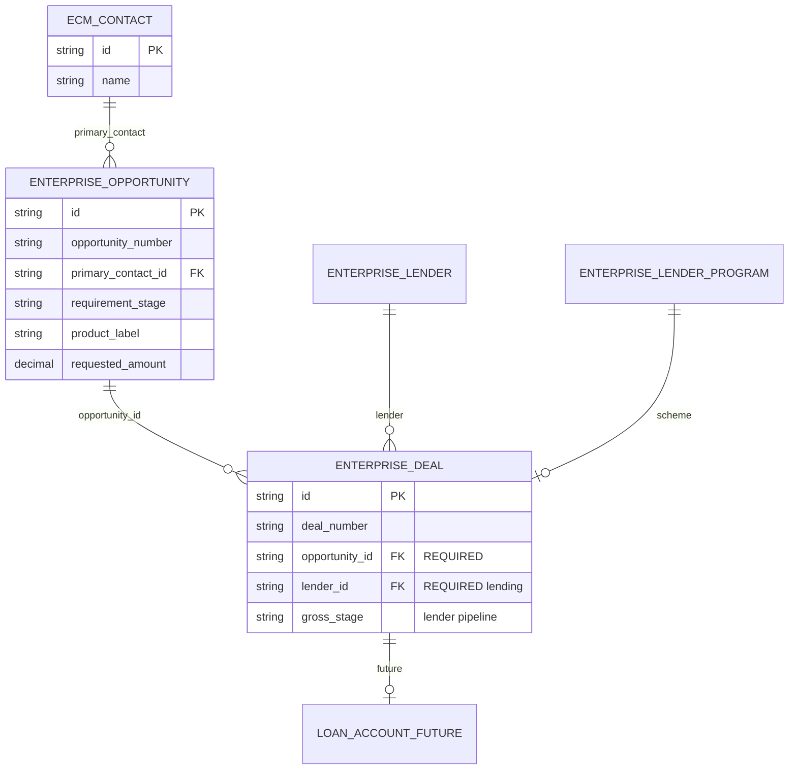
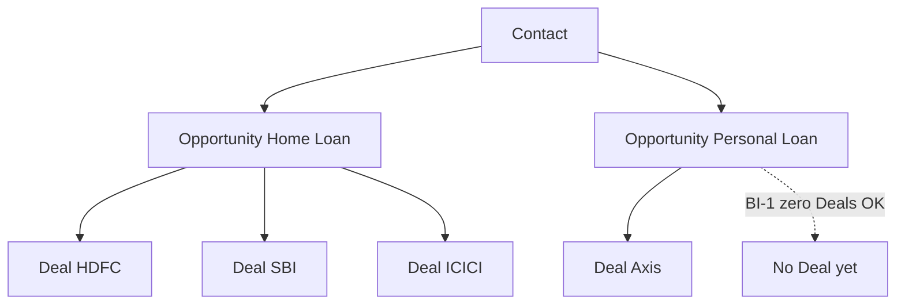

# CO-ARCH-003 Phase 2A — Opportunity–Deal Foundation  
# Schema & Architecture Observation Report (NO STRUCTURAL CHANGES)

**Status:** OBSERVATIONS SUBMITTED — awaiting approval before any migration or refactor  
**Date:** 2026-07-24  
**Gate:** Item 1 of Phase 2A — *submit observations before making structural changes*  
**Out of scope this document:** Chanakya, registries UI polish, Product Library, Workbench AI, UX polish (Phase 2B+)

**Related:**  
- BI-1…BI-4: `docs/co-arch-003/CO-ARCH-003-BUSINESS-INVARIANTS.md`  
- Phase 1 schema (not applied): `docs/co-arch-003/CO-ARCH-003-PHASE-1-OPPORTUNITY-SCHEMA-REVIEW.md`  
- Blueprint: `docs/co-arch-003/CO-ARCH-003-IMPLEMENTATION-BLUEPRINT.md`

---

## Executive finding

**The runtime and Postgres schema do not yet implement Contact → Opportunity → Deal.**

| Target (CO-ARCH-003) | Current reality |
|----------------------|-----------------|
| Opportunity = requirement (0…N Deals) | **No** `enterprise_opportunities` table |
| Deal = per-lender execution | `enterprise_deals` = **engagement / LoanFile** grain (product + amount + stage + optional primary lender) |
| Many Deals per Opportunity | Multi-lender state lives in `LoanFile.lenders[]` and/or `enterprise_deal_counterparty_assignments` — **not** first-class Deal rows in My Deals |
| Opportunity without Deal | UI “create loan/deal” creates a LoanFile / engagement Deal **without requiring a lender** (BI-3 violated) |

**Prerequisite:** Phase 1 Opportunity Registry schema must be **approved and applied** before Phase 2A can redefine Deal. Structural Phase 2A work cannot start until that gate clears.

---

## 1. Current database review (observations)

### 1.1 Opportunity tables

| Artifact | Present? | Notes |
|----------|----------|--------|
| `enterprise_opportunities` | **No** | Designed in Phase 1 review doc only; rolled back from Prisma; never migrated |
| `enterprise_opportunity_number_sequences` | **No** | Same |
| EOLE Opportunity types (TS) | Parallel / unused as SoR | Not wired as Postgres spine |

### 1.2 Deal tables (present)

| Table | Role today | Fit to CO-ARCH-003 Deal? |
|-------|------------|--------------------------|
| `enterprise_deals` | One row ≈ one customer engagement / LoanFile | **No** — acts as Opportunity+Deal hybrid |
| `enterprise_deal_counterparty_assignments` | Lender children under engagement Deal (`pipeline_stage`, registry id, program) | **Closest** to per-lender Deal, but not My Deals SoR |
| `enterprise_deal_*` children (docs, tasks, notes, commission, accounting, …) | Hang off engagement Deal id | Need re-scope to Opportunity vs Deal after split |
| `enterprise_deal_number_sequences` | `DEAL-YYYY-######` | Keep for lender Deal numbers post-split |

### 1.3 Relationship integrity (today)

```text
ecm_contacts 1 ── * enterprise_deals     (primary_contact_id NULLABLE)
enterprise_deals 1 ── * enterprise_deal_counterparty_assignments
```

| Check | Result |
|-------|--------|
| Opportunity → many Deals FK | **Missing** (no Opportunity table) |
| Deal → exactly one Opportunity | **Missing** |
| Deal requires lender | **Not enforced** (`primary_counterparty_*` nullable; create allows no lender) |
| Deal requires Contact | **Weak** (`primary_contact_id` nullable) |
| Unique active lender per engagement | **No** unique on `(deal_id, counterparty_registry_id)` for active rows |

### 1.4 Indexes / constraints (engagement Deal)

**Present (good):** org+deal_number unique; org+legacy_loan_file_id unique; list/contact/stage/RM indexes.

**Missing for target model:**

- `opportunity_id` FK + index (Phase 2)  
- NOT NULL lender identity on lending Deals  
- Unique `(opportunity_id, lender_id, program_id)` where not deleted (policy)  
- Opportunity-side indexes (Phase 1)

### 1.5 Runtime SSOT (non-Prisma)

| Store | Role |
|-------|------|
| `LoanFile` + `localStorage` (`compass:loan-files-data`) | Still primary create/read shape for workspaces |
| `LoanFile.lenders[]` | Multi-lender pipeline in browser |
| `createDealAsync` / dual-write | Maps LoanFile → `enterprise_deals` (engagement), optional counterparty sync |
| My Deals | One row per LoanFile; `dealId` = `opportunityNumberForFile(file)` (OPP alias of fileNumber) |

**Conflation proof:** `mapLoanFileToDealRegistryRow` sets `dealId` and `opportunityNumber` to the **same** OPP string.

---

## 2. Target database architecture (recommended — not applied)

```text
Customer (ecm_contacts)
    ↓ 1:N
Opportunity (enterprise_opportunities)     ← Phase 1
    ↓ 1:N
Deal (enterprise_deals REDEFINED)          ← Phase 2A
    ↓ 1:1 future
Loan Account (deferred)
```

### 2.A Updated ER diagram (target)



### 2.B Relationship diagram (cardinality)



**Never:** Deal → multiple Opportunities.

---

## 3. Opportunity entity — field ownership review

### 3.1 Belongs on Opportunity (requirement)

Customer, product, loan amount, purpose/transaction type, property/income (extensions), shared documents, notes, internal tasks, timeline (requirement-scoped), requirement stage, fulfilment mode/status.

### 3.2 Lender-specific data currently on engagement `enterprise_deals` / LoanFile (must migrate off Opportunity grain)

| Current location | Should move to Deal (Phase 2A) |
|------------------|--------------------------------|
| `primary_counterparty_*` | Lender / scheme on Deal |
| `gross_stage` / `sub_stage` when used as lender pipeline | Deal pipeline only (BI-4) |
| `approved_amount`, `fulfilled_amount` (per bank) | Deal sanction / disbursement |
| `payout_configured`, `settlement_completed`, revenue fields | Deal commercial / payout |
| `LoanFile.lenders[]` pipeline cases | One Deal row each |
| Counterparty `pipeline_stage` | Become Deal.gross_stage (or map 1:1 Deal ← assignment) |

### 3.3 Ambiguous / dual-scope (decide in implementation design)

| Object | Proposal |
|--------|----------|
| Documents | Shared KYC → Opportunity; bank login pack → Deal |
| Tasks / notes / timeline | Scope flag O \| D |
| Participants (co-app) | Opportunity primary; Deal may reference |

---

## 4. Deal entity — target contents

| Group | Fields |
|-------|--------|
| Link | `opportunity_id` **required** |
| Lender | Lender + scheme/program **required** (lending) |
| Pipeline | Login / approval / sanction / conditions / disbursement stages |
| Commercial | Sanction details, payout, commission links |
| Docs | Deal-scoped documentation |
| Identity | `deal_number` (`DEAL-YYYY-######`) |

**Create gate (BI-3):** reject if Opportunity missing or lender missing.

---

## 5. Relationship integrity — gap vs target

| Rule | Today | Target enforcement |
|------|-------|-------------------|
| Opp may have 0 Deals | N/A (no Opp table); engagement Deal often created instead | Opportunity create without Deal |
| Deal → 1 Opp | Missing | FK `opportunity_id` NOT NULL |
| Never Deal → many Opp | N/A | Single FK column |
| Lender required on Deal | Not enforced | CHECK / app validation + NOT NULL lender columns |

---

## 6. API validation review

| API / path | Observation | Required change (later) |
|------------|-------------|-------------------------|
| `POST /api/enterprise-deals` | Creates engagement Deal; lender optional; no Opportunity id | Split: Opportunity API + Deal API requiring opp+lender |
| `GET/PATCH/DELETE /api/enterprise-deals/:id` | Engagement grain | Remap to lender Deal; include `opportunityId` |
| Opportunity API | **Does not exist** | Phase 1 |
| `createDealAsync` (client DAL) | Creates LoanFile; dual-writes engagement Deal; no lender required | Become Opportunity create **or** Deal create with gates |
| Contact / Loan Information / Customer 360 create | Call `createDealAsync` / `addFileAsync` as “loan/deal” | Must create **Opportunity** first (BI-3) |
| My Deals load | One row per LoanFile / engagement | One row per lender Deal |

**Duplicate Opportunity risk:** Multiple LoanFile creates for same Contact+product with no uniqueness — after split, define uniqueness policy (e.g. allow multiple Home Loan Opportunities; optional soft warn).

**Orphan Deal risk:** Engagement Deals without Contact already possible; after split, orphans without Opportunity must be impossible via FK.

---

## 7. Repository / services / hooks — conflation inventory

| Area | Assumption “Opp ≈ Deal” |
|------|-------------------------|
| `deal-data-access.ts` | LoanFile is the Deal |
| `map-loan-file-to-deal.ts` / `map-deal-to-loan-file.ts` | 1:1 engagement bridge |
| `my-deals/deal-registry.ts` | `dealId === opportunityNumber` |
| `opportunityNumberForFile` | OPP label from LoanFile.fileNumber |
| `lead-opportunity-journey` | `fileId` + `opportunityId` dual keys for same LoanFile |
| `ensure-loan-workspace` | Creates Deal/LoanFile for opportunity id string |
| Chanakya Radar derive | `dealId: opportunityNumberForFile(file)` |
| CO-P0-006 primary write | “Deal create” = engagement LoanFile → `enterprise_deals` |

**Refactor scope for Phase 2A (when approved):** only paths required for entity split + integrity — **not** UI redesign.

---

## 8. UI compatibility (constraint)

Phase 2A must keep screens loading:

- Opportunity / Strategic / Loan workspaces  
- Deal / lender create paths (remapped under the hood)  
- Navigation routes unchanged at path level where possible  

No Chanakya/ticker/Product Library work in 2A.

---

## 9. Migration summary (proposed — **not executed**)

| Step | Action | Destructive? |
|------|--------|--------------|
| M0 | Approve + apply **Phase 1** Opportunity tables | Additive |
| M1 | Add nullable `opportunity_id` on `enterprise_deals` | Additive |
| M2 | Backfill: each engagement Deal / LoanFile → 1 Opportunity; each lender assignment / `lenders[]` → 1 Deal row (or promote assignment → Deal) | Data copy; no drop |
| M3 | Enforce `opportunity_id` NOT NULL + lender NOT NULL for new lending Deals | Constraint after backfill |
| M4 | Re-point My Deals / APIs to lender Deal grain | Code |
| M5 | Deprecate counterparty-as-pipeline SoR for lending | Later |

**No manual DB edits. No drops of `enterprise_deals` in 2A.**

---

## 10. Deliverables A–F

### A. Updated ER diagram

See §2.A (target). Current ER is Contact → engagement Deal → counterparty children (no Opportunity).

### B. Database relationship diagram

See §2.B.

### C. Migration summary

See §9 — **blocked** until Phase 1 schema approval + this observation report approval.

### D. List of modified files

**This observation sprint:** documentation only:

- `docs/co-arch-003/CO-ARCH-003-PHASE-2A-OBSERVATION-REPORT.md` (this file)

**No Prisma / API / UI code modified.**

### E. Potential risks

| Risk | Severity | Mitigation |
|------|----------|------------|
| Starting 2A Deal FK before Opportunity table exists | Critical | Finish Phase 1 first |
| Treating counterparty assignment as Deal without My Deals remap | High | Explicit promote/migrate design |
| Dual identity (LoanFile id vs Opp id vs Deal id) breaks deep links | High | Bridge fields + redirect map |
| CO-P0-006 “primary Deal write” creates wrong grain | High | Reframe as Opportunity primary write + Deal primary write |
| Unique Opp per Contact+product too strict | Medium | Policy: allow multiples |
| Breaking localStorage-only journeys mid-cutover | High | Dual-read; fail closed only after certify |

### F. Testing checklist (for when implementation is approved)

- [ ] Create Opportunity only → row in `enterprise_opportunities`; **0** `enterprise_deals` (BI-1, BI-3)  
- [ ] Assign lender → exactly one Deal with `opportunity_id` + lender (BI-2, BI-3)  
- [ ] Second lender → second Deal; same Opportunity  
- [ ] Reject Deal create without Opportunity  
- [ ] Reject Deal create without lender  
- [ ] My Deals shows **lender** rows, not requirement-only rows  
- [ ] Opportunity Workspace lists child Deals (when UI wired; smoke only in 2A)  
- [ ] No duplicate Opportunity on single create action  
- [ ] Existing Contact / Loan Workspace / navigation still load  
- [ ] Migration dry-run: no row loss; bridges populated  

---

## Recommended sequence (approval gates)

```text
1. Approve this Phase 2A Observation Report
2. Approve + implement Phase 1 Opportunity Registry (schema → migrate → API)
3. Approve Phase 2A structural design (Deal redefine + migration plan detail)
4. Implement Phase 2A (migrations + API/DAL integrity only)
5. Validate success criteria → then Phase 2B
```

---

## Decision requested

1. Confirm observations accurately describe current state.  
2. Confirm Phase 1 Opportunity Registry remains the first structural step.  
3. Prefer **Option A:** promote each lender assignment to a Deal row, vs **Option B:** keep assignment table as technical 1:1 behind Deal (recommend **A** for lending).  
4. Explicit approval to leave Plan Mode and create Prisma migrations.

**No structural changes have been made.**
