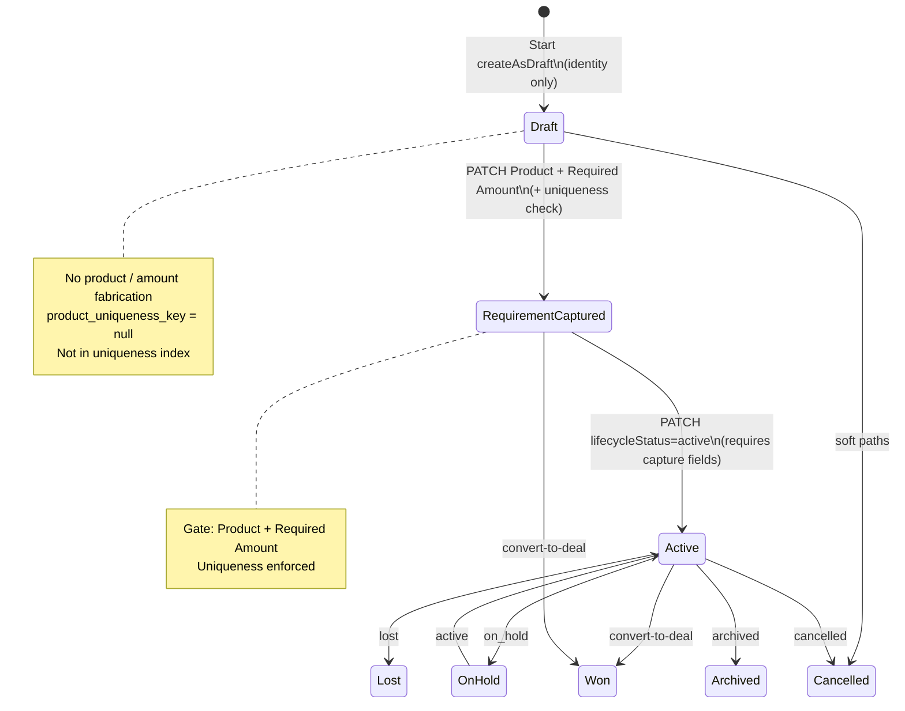

# ADR-018 Wave 1 — Persistence Foundation (Completion)

**Status:** **Wave 1 Certified** — see `CO-ARCH-ADR-018-WAVE1-CERTIFICATION.md`  
**Date:** 2026-07-25  
**Scope:** Opportunity Registry infrastructure — **no UI / navigation / workflow changes**

---

## Migration note (production)

Enum + index were split into two migrations to satisfy PostgreSQL `55P04`:

1. `20260725010000_adr_018_w1_opportunity_lifecycle` — ADD VALUE only  
2. `20260725010100_adr_018_w1_opportunity_uniqueness_index` — index recreate  

**Applied on target DB:** 2026-07-25 · Latest: `20260725010100_adr_018_w1_opportunity_uniqueness_index`

---

## Lifecycle diagram



Business states: **Draft → Requirement Captured → Active Opportunity**

---

## Updated data model

| Item | Change |
|------|--------|
| `OpportunityLifecycleStatus` | Added `draft`, `requirement_captured` |
| Uniqueness index `eopp_active_contact_product_uidx` | Now includes `requirement_captured` (+ `active`, `on_hold`); still excludes `draft` and null keys |
| API serialize | `requirementCaptured` boolean (field gate) |
| Create | `createAsDraft` / `lifecycleStatus: draft` — identity only |
| Update | `PATCH /api/enterprise-opportunities/:id` |

---

## Schema / migration

**Migration:** `prisma/migrations/20260725010000_adr_018_w1_opportunity_lifecycle/migration.sql`

**Manual ops:** Apply migration on target DB before relying on Draft / Requirement Captured enums:

```bash
npx prisma migrate deploy
# or environment-equivalent
```

**Notes:**
- Existing rows remain `active` — UX unchanged.
- `ALTER TYPE … ADD VALUE` requires PostgreSQL supporting enum extend; run migrate on certification/prod DB.
- Partial unique index rebuild is online-safe for typical volumes; brief lock on index create.

---

## Opportunity API

| Method | Path | Purpose |
|--------|------|---------|
| POST | `/api/enterprise-opportunities` | Create (legacy product path **or** Draft via `createAsDraft`) |
| PATCH | `/api/enterprise-opportunities/:id` | Update business fields; auto-promote Draft→Requirement Captured when Product+Amount set |
| GET / DELETE | unchanged | |

Client: `enterpriseOpportunityApiClient.updateOpportunity`, `createAsDraft` on create.

---

## Uniqueness (CAD + ADR-018)

| Moment | Behaviour |
|--------|-----------|
| Draft create | **No** uniqueness check; no product key |
| Requirement Capture (PATCH) | **Yes** — Contact + Product vs `requirement_captured`/`active`/`on_hold` |
| Legacy create (non-draft) | Unchanged — uniqueness at create (current Start Loan Journey UX) |

---

## Regression assessment

| Area | Risk | Mitigation |
|------|------|------------|
| Start Loan Journey UI | None intended | Still uses non-draft create + Home Loan default |
| My Opportunities list | Low | New drafts only if callers use `createAsDraft` |
| Convert-to-deal / won | None | Still leaves uniqueness set |
| FS-01 / OW | None | No routing/UI changes |
| CAD display | None | No fabricated fields added |

---

## Business impact assessment

| Stakeholder | Impact |
|-------------|--------|
| RM (today) | **No change** — same Start → `/credit-bench` path |
| Platform | Ready for Wave 2 Lead Information (PATCH + Draft create) |
| Data quality | Future Draft path stops inventing product/amount at create |
| Compliance | Aligns persistence with CAD-2026-001 + ADR-018 |

---

## Explicitly not in Wave 1

Lead Information Workspace · Start routing · Execution Hub · OW gates · Continue Journey · UI

---

## SSOT files

- `docs/adr/ADR-018-start-loan-journey-draft-lead-information.md`
- `src/constants/opportunity-lifecycle.ts`
- `src/constants/opportunity-active-uniqueness.ts`
- `server/services/enterprise-opportunity/index.ts`
- `server/repositories/enterprise-opportunity/enterprise-opportunity.repository.ts`
- `src/lib/enterprise-opportunity/opportunity-api-client.ts`
- `prisma/migrations/20260725010000_adr_018_w1_opportunity_lifecycle/`
