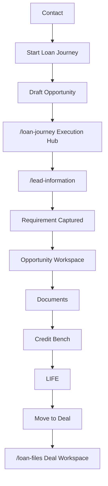

# ADR-018 Wave 3 — Execution Hub & Journey Routing

**Status:** Implemented (awaiting BAT / Business Certification)  
**Date:** 2026-07-25  
**Parent:** [ADR-018](../adr/ADR-018-start-loan-journey-draft-lead-information.md)  
**Route lock:** [WAVE3-HUB-ROUTE-LOCK](./CO-ARCH-ADR-018-WAVE3-HUB-ROUTE-LOCK.md)

## Objective

Routing and orchestration only. No new business features. No Deal/LoanFile before Move to Deal.

## Routing map

| Surface | Canonical route | Notes |
|---------|-----------------|-------|
| Execution Hub | `/loan-journey` | Roadmap · Continue · Resume · Chanakya |
| Lead Information | `/lead-information?opportunityId=` | Draft capture (Wave 2) |
| Opportunity Workspace entry | `/credit-bench?opportunityId=` | OW stage 1 after Requirement Captured |
| Documents | `/document-center?opportunityId=` | Unchanged |
| Credit Bench | `/credit-workbench?opportunityId=` | Unchanged |
| LIFE | `/opportunities?opportunityId=` | Gated until Requirement Captured |
| Deal / Loan Files book | `/loan-files?file=` · browse | Unchanged Deal behaviour |

## Navigation architecture

- Primary nav **Loan Journey** → `/loan-journey` (Execution Hub).
- **My Deals** / deep links → `/loan-files` Deal book unchanged.
- Compat: `/loan-files?entry=dashboard` (Hub host) redirects to `/loan-journey`.

## Redirect strategy

1. **Start Loan Journey** → create Draft Opportunity → `/loan-journey?opportunityId=`
2. **Continue / Resume** (Draft) → `/lead-information?opportunityId=`
3. **Save & Continue** (Requirement Captured) → Opportunity Workspace (`/credit-bench?opportunityId=`)
4. **OW / Documents / Credit / LIFE** with Draft Opportunity → redirect `/lead-information?opportunityId=`
5. **Hub-on-loan-files** → `/loan-journey` (preserve `opportunityId`)
6. **Deal `?file=`** → stay on `/loan-files` (no Hub redirect)

## Journey flow

## Backward compatibility assessment

| Concern | Assessment |
|---------|------------|
| `/loan-files?file=` Deal deep links | Preserved — Deal book path unchanged |
| Loan Files browse / Kanban / Timeline | Preserved when `browse=1` or `file` present |
| Create Loan Modal on Deal book | Still available on Deal book surface only |
| Hub formerly at `/loan-files?entry=dashboard` | Redirects to `/loan-journey` |
| Canonical Journey Header stage order | Unchanged (presentation sequence frozen) |
| LoanFile / Deal mint on Start | Not created — Draft Opportunity only |

## Regression assessment

| Area | Risk | Mitigation |
|------|------|------------|
| Start lands on Hub not OW | Intentional ADR-018 | Toast + href updated |
| Draft blocked from OW | Intentional gate | Redirect to Lead Information |
| Nav label Loan Workspace → Loan Journey | Low | Primary href points to Hub |
| Deal execution | Low | `/loan-files` Deal path untouched |
| Credit-bench enrichment after capture | Medium | Entry is OW stage 1; no UI redesign |

## BAT checklist

- [ ] Contact → Start Loan Journey creates **Draft** Opportunity (no product/amount defaults)
- [ ] User lands on **`/loan-journey?opportunityId=`**
- [ ] Hub shows roadmap, current stage, Continue, Resume, Chanakya
- [ ] Continue Journey (Draft) opens **`/lead-information?opportunityId=`**
- [ ] Save Product + Amount → Requirement Captured
- [ ] Save & Continue opens Opportunity Workspace (`/credit-bench?opportunityId=`)
- [ ] Opening `/credit-bench` / `/opportunities` / Documents with Draft redirects to Lead Information
- [ ] Existing Deal Workspace `/loan-files?file=` still opens Deal
- [ ] Existing Deal deep links still function
- [ ] No LoanFile row created before Move to Deal
- [ ] No Deal row created before Move to Deal
- [ ] `/loan-files?entry=dashboard` redirects to `/loan-journey`

## Implementation SSOT

- Routing helpers: `src/lib/loan-journey/adr-018-routing.ts`
- Gate hook: `src/lib/loan-journey/use-requirement-captured-gate.ts`
- Hub page: `src/app/(dashboard)/loan-journey/page.tsx`
- Start: `src/lib/enterprise-opportunity/start-opportunity-from-contact.ts`
