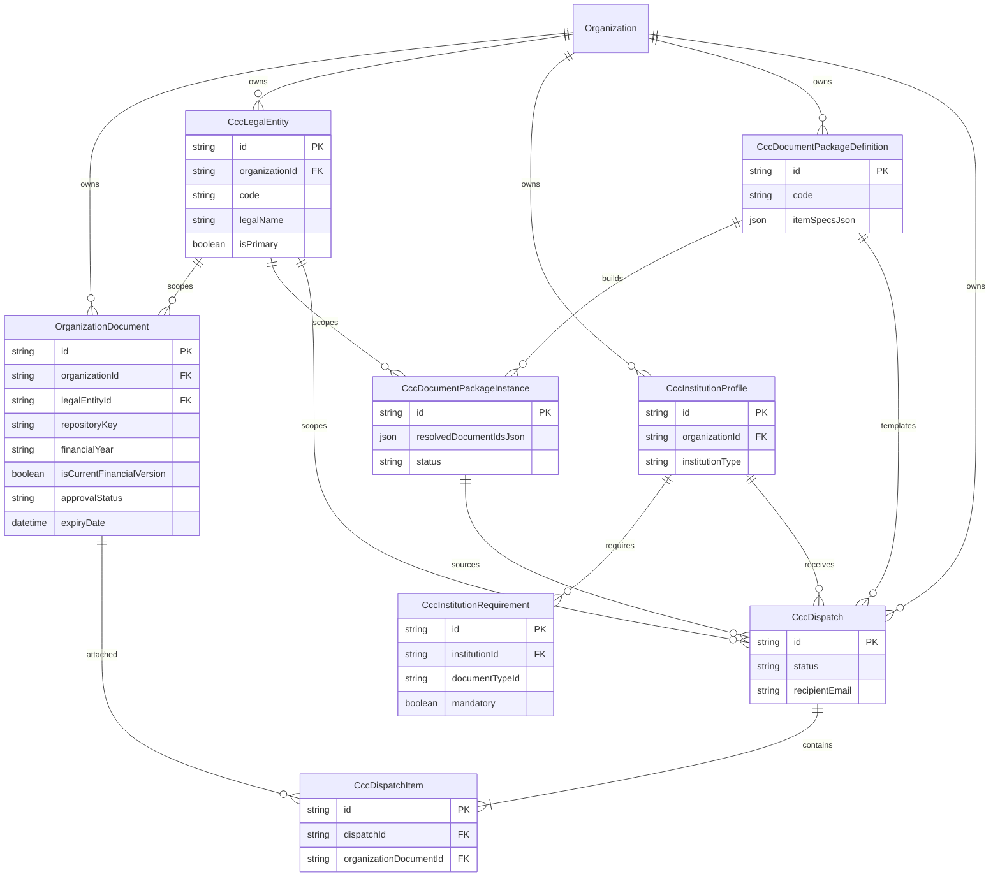

# CO-CCC-001 — Entity Relationship Diagram

## Notes

- **OrganizationDocument** remains the sole binary SSOT; CCC fields are compliance metadata only.
- **Compliance alerts** are not persisted — computed by `deriveComplianceIntelligence`.
- Supersession chain uses `OrganizationDocument.supersededByDocumentId` (self-reference by ID, no FK constraint).
