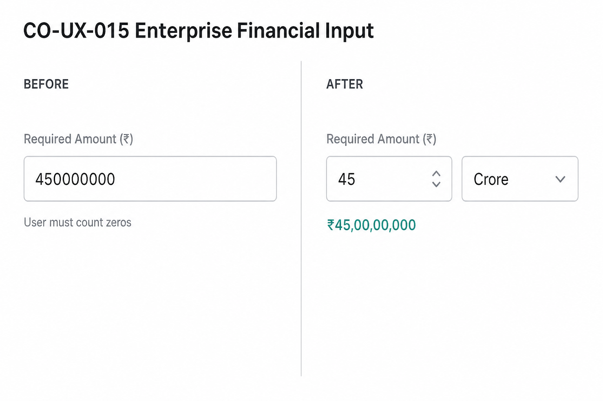

# CO-UX-015 — Enterprise Financial Input Standard

**Status:** Implementation Complete · Ready for Business Acceptance Testing  
**Date:** 2026-07-31  
**Scope:** UI/UX only — production data protection observed

---

## 1. Shared component location

| Artefact | Path |
|---|---|
| **Canonical component** | `src/components/catalyst-one/shared/enterprise-financial-input.tsx` |
| Compatibility alias | `src/components/catalyst-one/shared/inr-currency-input.tsx` → re-exports EFI |
| Convert helpers | `src/lib/enterprise-financial-input/index.ts` |
| Unit constants | `src/constants/enterprise-financial-input.ts` |
| Verify | `npm run verify:co-ux-015` |

### Layout

```
[ Numeric Value ]   [ Unit ▼ ]
Equivalent Value
₹45,00,00,000
```

### Units

- Thousand (× 1,000)
- Lakh (× 1,00,000)
- Crore (× 1,00,00,000)

### Behaviour (examples)

| Entry | Display | Stored |
|---|---|---|
| 45 + Crore | ₹45,00,00,000 | `450000000` |
| 75 + Lakh | ₹75,00,000 | `7500000` |
| 2.5 + Crore | ₹2,50,00,000 | `25000000` |

Decimals allowed · negatives / invalid text rejected.

---

## 2. Fields migrated

### Via `INRCurrencyInput` alias (automatic upgrade)

| Surface | Fields |
|---|---|
| Loan create form | Required Loan Amount, property value (via Property card / employment pack) |
| Employment income fields | Monthly Salary, Annual Turnover, Net Salary, GST Turnover, Annual Professional Income |
| Existing loan (BT) | Outstanding Loan Amount |
| Loan workspace modal | Required Amount, Outstanding (BT), Approximate Property Value |
| Edit Deal dialog | Loan Amount |
| Final approved terms | Final Loan Amount |
| Lender Pipeline board | Expected Loan Amount, Sanction / related INR fields |
| Chanakya gap inline field | Amount gap capture |

### Direct `EnterpriseFinancialInput` migration

| Surface | Fields |
|---|---|
| Lead Information | Required Amount |
| Modify Loan Details sheet | Required Amount |
| Property Information card | Approximate Property Value |
| Analyze Deal | Requested Loan Amount, Property Value, Monthly Income, Salary Credits, Business Turnover, ITR, Banking, Profit, Rental Income, Existing EMI |
| Credit Bench | Stated Monthly Income, Stated Annual Turnover, Property Value |
| Enterprise Credit Workspace (left panel) | Stated Monthly Income, Annual Turnover, Stated Property Value |
| Company Workspace | Annual Turnover, Approximate Net Profit |

### Intentionally not migrated (not absolute ₹ amount entry)

- ROI % · Fee % · Tenure · CIBIL · Business Vintage (years)
- Wealth Partner commercial **percentage** fields
- Registry filter chips (min/max ROI, fee)
- Free-text “Obligations / EMIs” notes where not a pure amount control
- Read-only EMI / Outstanding display cards (format only)

---

## 3. Before / After

Illustrative comparison (also saved at `docs/co-ux-015/co-ux-015-before-after.png`):



**BAT live capture** — Lead Information → Required Amount (or Loan Create → Required Loan Amount):

**Before**

- Single text box requiring `450000000` (or comma-grouped zeros).
- User must count zeros.

**After**

1. Enter `45`, select **Crore**.
2. Equivalent line shows `₹45,00,00,000`.
3. Persist / Save — network / DB payload still absolute `450000000`.

Repeat for `2.5` + Crore → equivalent `₹2,50,00,000` → store `25000000`.

---

## 4. Verification Report

| Check | Result |
|---|---|
| Existing calculations unchanged | ✅ Conversion is UI-only; calculators still receive absolute rupees |
| Existing APIs unchanged | ✅ No route / payload schema change |
| Existing database unchanged | ✅ No migration · no Prisma unit column |
| Stored values remain numeric absolute | ✅ `onChange` emits absolute rupees |
| Shared single implementation | ✅ One component + alias |
| Static verify script | `npm run verify:co-ux-015` |

### Production data protection

- Did **not** modify existing stored values
- Did **not** change database schema
- Did **not** change APIs
- Did **not** change calculation engines

---

## 5. Confirmation — financial calculations unaffected

All engines (EMI, eligibility hints, Radar, EBI, Opportunity Registry amounts, Deal amount) continue to consume **absolute rupee numbers**.  
`EnterpriseFinancialInput` only converts magnitude × unit → absolute at the form edge before the same `onChange` / PATCH paths as before.

---

## 6. Follow-ups (optional BAT)

- Marketing site `LeadForm` monthly income (COMPASS public form) — still plain numeric; migrate if Product wants EFI on public lead capture.
- Any future monetary field **must** import `EnterpriseFinancialInput` (or the alias).
