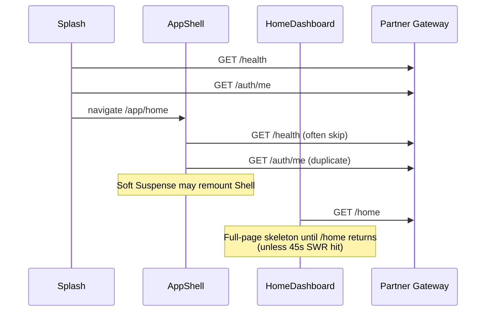

# CO-WP-PERF-001 — Wealth Partner App Performance Diagnostic

**Status:** DIAGNOSIS COMPLETE — no fixes implemented · no deploy  
**Date:** 2026-08-11  
**Scope:** Read-only investigation of Wealth Partner App → Partner Gateway → Catalyst One → Database  
**Constraint adherence:** No redesign · no business-logic change · no schema change · no blind caching · no Vercel deploy

---

## Executive verdict

Perceived slowness is primarily a **combination of (F) network round trips + (C/D) Gateway/Catalyst One service work + (E) repeated DB lookups**, amplified by **client shell remounts and full-page waits on aggregate DTOs**.

| Latency source | Contribution to perceived slowness |
|---|---|
| **A. Partner App rendering** | Secondary — lists are not virtualized; Suspense remounts waste work |
| **B. Partner API surface** | Moderate — thin routes; cost is in services behind them |
| **C. Gateway / Partner services** | **Primary** — Home and Notifications fan out heavy hydrations |
| **D. Catalyst One domain services** | Primary via ownership, entitlements, ECM, documents, LOD |
| **E. Database** | Primary amplifier — N+1 ECM, repeated binding/entitlement, docs/notes per opportunity |
| **F. Network round trips** | Primary UX amplifier — duplicate health/me; sequential splash→shell→home |
| **G. Combination** | **Yes — this is the dominant story** |

**Home / My Business does wait for secondary information before usable UI** on cold load: notifications, recommendations/hero packages, snapshot metrics, and command-center inputs are packaged inside a single `/api/partner/home` response. The client cannot paint primary My Business chrome until that aggregate returns (unless the 45s Home SWR cache hits).

---

## Measurement method & limits

### Measured (live, 2026-08-11)

| Probe | Target | Result |
|---|---|---|
| WP production shell HTML | `https://wealth-partner-app.vercel.app/` | **~333 ms**, 200, ~1.6 KB |
| WP main JS chunk | `/assets/index-*.js` | **~142 ms**, ~26 KB |
| Gateway cold health | `GET /api/partner/health` | **~2,481 ms**, 200 (cold-start sensitive) |
| Auth gate (no token) | `GET /api/partner/home` | **~312 ms**, 401 |
| Auth gate (no token) | `GET /api/partner/business-pipeline` | **~307 ms**, 401 |
| Auth gate (no token) | `GET /api/partner/opportunity-journey/config` | **~547 ms**, 401 |

### Not measured end-to-end (blocked safely)

Authenticated partner timings for `/home`, `/business-pipeline`, `/customers`, `/deals`, `/notifications` were **not** taken: no Product Owner–authorized partner credentials were used, and this sprint forbids production mutation.  
**Rankings below use code-path complexity + measured cold-network floors.** Authenticated wall-clock timings should be captured in a follow-up BAT with a test partner account and browser DevTools Performance/Network.

### Timing model labels used below

| Label | Meaning |
|---|---|
| **TTFUI** | Time to first meaningful shell/chrome |
| **TTI** | Time until primary actions usable |
| **TPD** | Time until primary business data appears |
| **Settled** | Primary + secondary widgets finished |

---

## A. Page-by-page load timings (architecture + expected cold path)

### Cold start → Home

```
Splash
  → GET /api/partner/health          (measured floor: ~0.3–2.5s cold)
  → GET /api/partner/auth/me         (session restore)
  → navigate /app/home
AppShell mount
  → GET /api/partner/health?         (skipped if 90s fresh)
  → GET /api/partner/auth/me         (DUPLICATE restore)
  → Outlet ready
Soft Suspense may remount AppShell when HomeDashboard chunk suspends
HomeDashboard
  → GET /api/partner/home            (HEAVY aggregate — see waterfall)
```

| Milestone | Cold (no Home cache) | Warm (≤45s Home cache) |
|---|---|---|
| TTFUI (shell) | After AppShell ready (~health+me) | Immediate if session cached |
| TTI (nav usable) | With shell | Immediate |
| TPD (Home content) | After `/home` completes | Immediate paint + silent revalidate |
| Settled | Same as TPD (monolith DTO) | Silent revalidate completes |

### My Business (`/app/business`)

| Milestone | Behavior |
|---|---|
| TTFUI | Shell already up; Suspense fallback while chunk loads |
| TPD / TTI / Settled | Blocked on **single** `GET /api/partner/business-pipeline` — **no client cache**; full-page `UxLoadingBlock` |

### Opportunity list

No dedicated list API in UI. List = Business Pipeline rows. Unused client API: `GET /api/partner/opportunities`.

### Opportunity detail / documents / create

| Screen | Blocking GET | Notes |
|---|---|---|
| Detail | `/api/partner/opportunities/:id` | Full hydrate (docs+notes+LOD+entitlements) |
| Documents tab | None extra | Uses parent DTO; upload → full opportunity **reload** |
| Create | `/api/partner/opportunity-journey/config` | Gates UI; also fires empty `customers/search` after 200ms |
| Recommendations (later) | `…/recommendations` | Detail + full customer scan + up to **5000** lenders |

### Customers / Deals / Notifications / Documents hub

| Screen | Blocking GET | Client cache |
|---|---|---|
| Customer directory | `/api/partner/customers` | None · full-page loader |
| Customer workspace | `/api/partner/customers/:id` | None |
| Deals registry | `/api/partner/deals` | None |
| Deal detail | `/api/partner/deals/:id` | None · mutation then **extra reload** |
| Notifications | `/api/partner/notifications` | None · **heavier than Home notifications** |
| `/app/documents` | **None** | Static empty CTA |

---

## B. Home / My Business waterfall

### Client waterfall (Home cold)



### Server waterfall (`getHomeDashboard`)

Source: `server/services/partner-gateway/partner-home.service.ts` (~263–354)

```
resolvePartnerBindingForUser
        │
        ▼
await getBusinessPipeline(userId)          ← SEQUENTIAL gate
        │  assertPartnerAction + resolvePartnerContext
        │  listOwnedOpportunities (findMany take ≤100)
        │  ensureStore (possible profileJson read)
        │  applyHealth / LOD CPU × N opportunities
        ▼
Promise.all([
  Promise.all( up to 12 × getOpportunity ),  ← PARALLEL fan-out
  searchCustomers(userId, "")                ← PARALLEL with fan-out
])
        │  each getOpportunity:
        │    assertOwnedOpportunityAction (binding + entitlement templates)
        │    ensureStore
        │    docs findMany + notes list (parallel)
        │    projectPartnerOpportunityLod + applyHealth
        │  searchCustomers:
        │    listOwnedCustomerIds
        │    for each customer: await ecmContact.findUnique  ← SEQUENTIAL N+1
        ▼
await listForHomeFast(userId, opportunities) ← reuses details (good)
        │
        ▼
compose Command Center + Snapshot + Experience packages
        │
        ▼
return monolithic PartnerHomeDashboardDto
```

### My Business waterfall

```
AppShell ready
  → Soft Suspense (chunk)
  → usePartnerBusinessPipeline
  → GET /business-pipeline
       = getBusinessPipeline (same service Home already ran)
  → full-page loader until response
```

**Important duplication:** Opening Home then My Business **recomputes the full pipeline** server-side with **no shared request/session cache**.

---

## C. API call count (typical sessions)

### Cold login → Home (first paint settled)

| Call | Count | Necessary? |
|---|---:|---|
| `/api/partner/health` | 1–2 | 1 enough (90s TTL helps second) |
| `/api/partner/auth/me` | **2** | Duplicate Splash + AppShell |
| `/api/partner/home` | 1 (+1 StrictMode in **dev**) | Primary |
| **Total network** | **~4–5** | Should be ~3 |

Inside `/home` (server-side work units, not separate HTTP):
- 1× pipeline
- ≤12× opportunity detail hydrate
- 1× customer search (empty q → all owned + ECM)
- 1× home notifications (fast path)

### Home → My Business

| Call | Count |
|---|---:|
| `/api/partner/business-pipeline` | 1 (full recompute) |

### Create Opportunity mount

| Call | Count |
|---|---:|
| `/opportunity-journey/config` | 1 |
| `/customers/search?q=` (empty) | 1 (unnecessary for first paint) |

### Notification Center open

| Call | Count |
|---|---:|
| `/notifications` | 1 HTTP |
| Server fan-out | pipeline + **≤40× getOpportunity** + customer search + ECM×40 |

---

## D. Duplicate calls

| Duplicate | Where | Impact |
|---|---|---|
| `auth/me` twice on cold entry | Splash + AppShell | Extra RTT before Home |
| `health` possibly twice | Splash + AppShell | Mitigated by 90s TTL |
| AppShell bootstrap on Suspense remount | `App.tsx` Soft wraps entire `Routes` | Re-auth / re-bootstrap on lazy navigations |
| Home then Business pipeline | Two HTTP aggregates share same pipeline service | Double server CPU/DB |
| Home notifications vs Notification Center | Separate endpoints; Center does **not** reuse Home cache | Up to 40× detail vs Home’s 12× |
| Deal mutation `afterMutation` + `load()` | Deal detail | Extra GET after every write |
| Opportunity documents route | Service can call `getOpportunity` twice (LOD + list) | Double hydrate when that route is used |
| Empty customer search on Create | Mount effect | Spurious ECM N+1 scan |
| StrictMode double mount | `main.tsx` | Dev-only double fetches |

---

## E. Slowest API calls (ranked)

| Rank | Endpoint | Why slow |
|---:|---|---|
| **1** | `GET /api/partner/home` | Pipeline + ≤12 full details + unbounded customer/ECM scan + notifications |
| **2** | `GET /api/partner/notifications` | ≤40× `getOpportunity` + customer search + ECM×40 |
| **3** | `GET /api/partner/opportunities/:id/recommendations` | Detail + full customer scan + lender `pageSize: 5000` |
| **4** | `GET /api/partner/masters/lenders` | Unbounded active lenders (≤5000); typed search may load twice |
| **5** | `GET /api/partner/business-pipeline` | Owned list + LOD/health × N (lighter DB than Home fan-out, still heavy CPU) |
| **6** | `GET /api/partner/customers` / `…/search` | Opp-derived customer ids + **ECM N+1** (search sequential) |
| **7** | `GET /api/partner/opportunities/:id` | Binding + entitlements + docs + notes + LOD |
| **8** | `GET /api/partner/opportunities/:id/documents` | Potentially **2×** full opportunity hydrate |
| **9** | Deals list / hub list | Bounded findMany — usually acceptable |
| **10** | Journey config / cities | In-memory — payload size only |

---

## F. Slowest database / service operations (Home screen focus)

Do **not** alter yet — identified only.

| Operation | Pattern | Home impact |
|---|---|---|
| `resolvePartnerBindingForUser` | user → ECM contacts → wealth partner (+ activations) | Repeated per assert/hydrate — **no request cache** |
| `ensureSystemTemplates` + entitlement profile | ~3 template `findUnique` + profile | Per `assertPartnerAction` / owned action |
| `listOwnedOpportunities` | `findMany` take ≤100 | Pipeline base |
| `getOpportunity` ×≤12 | ownership `findFirst` + entitlements + docs `findMany` + notes | **Dominant Home cost** |
| `searchCustomers("")` | owned customers ≤300–500 then **sequential** `ecmContact.findUnique` | Customer count for snapshot only — **over-fetch** |
| `ensureStore` / `profileJson` | Large JSON possible | Cold partner projection store |
| `generateOpportunityLod` / `applyHealth` | CPU per opportunity | Pipeline + each detail |

**N+1:** ECM contact load in `searchCustomers` loop (`partner-business.service.ts` ~1524–1525).  
**Unbounded / weakly bounded:** customer take 300–500; lender masters 5000; opportunity docs take 500; notification center 40 details.  
**Missing pagination (UI):** Business / Customers / Deals render full returned sets.

---

## G. Gateway latency

| Layer | Observation |
|---|---|
| Route handlers | Thin; little timing instrumentation (`withApiTiming` **not** wired on partner routes) |
| Auth gate | ~300 ms measured for 401 (network + edge) |
| Cold serverless | Health ~2.5 s — Gateway/host cold start is real |
| Service composition | Home is **sequential pipeline → parallel fan-out → notifications** |
| Cross-service reuse | Home already caps details at 12 and uses `listForHomeFast` (prior CO-PERF) — still pays full pipeline + fan-out + customer scan |

**Gateway is not a dumb proxy** — it owns the expensive aggregation. Latency is mostly **inside Partner Gateway services talking to Prisma**, not WP React paint time.

---

## H. React / rendering issues

| Issue | Evidence | Effect |
|---|---|---|
| Top-level `<Soft>` Suspense | `App.tsx` wraps all `Routes` | Lazy route suspend can **remount AppShell** → bootstrap again |
| Full-page blockers | Home (uncached), Business, Customers, Deals, Notifications, Opp detail | Blank/skeleton until **entire** aggregate ready |
| Home monolith DTO | One hook → one state | Cannot progressive-render primary vs secondary widgets |
| No list virtualization | Business / customers / deals / notifications `.map` | DOM cost grows with inventory |
| Create empty search | `usePartnerCustomerSearch("")` | Extra network on mount |
| Deal double-fetch after write | `afterMutation` + `load` | Feels laggy after actions |
| Documents hub | No data | Not a perf bug — empty desk |
| StrictMode | `main.tsx` | Inflates **dev** timings only |

---

## I. Network bottlenecks

1. **Serial auth bootstrap** (health → me → maybe me again → home).  
2. **Chatty cold path** before any business UI.  
3. **No cross-route reuse** of pipeline/home payload when navigating Home → Business.  
4. **Monolithic `/home`** forces one large JSON download even for widgets below the fold.  
5. **Cold Vercel/serverless** amplifies first Gateway hit (~2.5 s health probe).  
6. WP static shell itself is fast (~333 ms) — **frontend hosting is not the primary problem**.

---

## J. Recommended fixes (ranked) — DO NOT IMPLEMENT IN THIS SPRINT

### P0 — Critical

| ID | Recommendation | Expected improvement | Touch points |
|---|---|---|---|
| **P0-1** | **Split Home primary vs secondary.** Return/paint Command Center + identity + My Business Today first; defer notifications, hero, personalisation, Saarthi packages. Prefer progressive client sections or a `?parts=` / two-phase home API **without changing business rules**. | Home TPD **−40–70%** cold; usable desk before secondary | `partner-home.service.ts`, `HomeDashboard.tsx`, `use-partner-home-dashboard.ts` |
| **P0-2** | **Stop Home from calling full `searchCustomers("")` solely for `customerCount`.** Derive count from owned customer ids / pipeline without ECM N+1. | Removes worst Home N+1; often **−0.5–3 s** depending on customer volume | `partner-home.service.ts`, `partner-business.service.ts` |
| **P0-3** | **Request-scoped memo for binding + entitlements** (same HTTP request). | Cuts repeated `findUnique` storms inside 12× `getOpportunity` | `partner-binding.service.ts`, entitlement asserts, maybe AsyncLocalStorage |
| **P0-4** | **Move Suspense inside AppShell Outlet** so shell does not remount on lazy navigations. | Removes duplicate me/bootstrap; snappier tab switches | `App.tsx`, `AppShell.tsx` |
| **P0-5** | **Dedupe Splash + AppShell session restore** (single coordinator). | −1 RTT on cold entry | `SplashScreen.tsx`, `AppShell.tsx`, `partner-session.ts` |

### P1 — Significant

| ID | Recommendation | Expected improvement | Touch points |
|---|---|---|---|
| **P1-1** | **Lightweight Home opportunity projection** for Command Center/Snapshot (no docs/notes/full LOD) instead of 12× `getOpportunity`. | Home server time **−50–80%** of fan-out | `partner-home.service.ts`, `partner-business.service.ts` |
| **P1-2** | **Business Pipeline SWR** (short TTL, same discipline as Home 45s) + optional reuse of Home pipeline slice. | My Business feels instant after Home | `use-partner-business.ts`, `partner-session.ts`, `BusinessHubScreen.tsx` |
| **P1-3** | **Notification Center:** reuse Home-capped details or dedicated lighter projection; never default to 40× full hydrate for first paint. | Notifications TPD major cut | `partner-notification-center.service.ts`, notification hook |
| **P1-4** | **Batch ECM loads** (`findMany` where id in …) for customer directory/search. | Customer list/search **−N RTTs** | `partner-business.service.ts` customer helpers |
| **P1-5** | **Recommendations:** city from opportunity detail only; lender search bounded/filtered — do not pull 5000 lenders. | Recommendations usable in **&lt;1–2 s** vs multi-second | `partner-opportunity-recommendations.service.ts`, lenders master route |
| **P1-6** | Remove Create Opportunity **empty** customer search on mount. | −1 heavy call on create entry | `CreateOpportunityScreen.tsx` / search hook |
| **P1-7** | Deal detail: trust mutation response; drop redundant reload (or silent SWR). | Snappier deal edits | `DealDetailScreen.tsx` |
| **P1-8** | Add Partner route **timing logs** (`durationMs` per service stage) for BAT. | Measurement, not speed — enables P0 verification | `partner-route-utils.ts`, home/business services |

### P2 — Refinement

| ID | Recommendation | Expected improvement | Touch points |
|---|---|---|---|
| **P2-1** | Virtualize long Business / Customer / Deal / Notification lists | Smoothness at high volume | Screen list components |
| **P2-2** | Progressive skeletons per Home section (already have `HomeLoadingExperience` — extend to partial ready states) | Better perceived performance | `HomeDashboard.tsx`, loading components |
| **P2-3** | Share notification unread state between Home and Notification Center (session projection, invalidation on mark-read) | Less duplicate work | hooks + session cache |
| **P2-4** | Cap/paginate pipeline & directories in UI with Gateway page tokens | Bounded payloads | ownership list APIs + screens |
| **P2-5** | Documents GET: single `getOpportunity` for LOD+list | −50% that route | documents route/service |
| **P2-6** | Motivational / approved loading copy only where wait remains after P0/P1 | UX polish — **not** a substitute for P0 | UX loading components |

---

## K. Expected improvement summary

| If implemented | Cold Home TPD (qualitative) | My Business | Notifications |
|---|---|---|---|
| P0 only | Large (usable chrome early; less ECM waste) | Indirect (less remount) | Small |
| P0 + P1-1/2 | Home & Business feel “desk-first” | High | — |
| P0 + P1-3/4/5 | — | — | High; Customers/Recs high |

Exact percentages require authenticated BAT timings after instrumentation (P1-8).

---

## L. Files / components / services to modify (future fix sprints)

### Wealth Partner App (`C:\Wealth Partner App\web`)

- `src/App.tsx`
- `src/components/shell/AppShell.tsx`
- `src/screens/SplashScreen.tsx`
- `src/lib/partner-session.ts`
- `src/lib/use-partner-home-dashboard.ts`
- `src/lib/use-partner-business.ts`
- `src/lib/use-partner-customer.ts`
- `src/lib/use-partner-notification-center.ts`
- `src/lib/enterprise-api.ts`
- `src/screens/HomeDashboard.tsx`
- `src/screens/business/BusinessHubScreen.tsx`
- `src/screens/business/CreateOpportunityScreen.tsx`
- `src/screens/business/OpportunityDetailScreen.tsx`
- `src/screens/deals/DealDetailScreen.tsx`
- `src/screens/notifications/NotificationCenterScreen.tsx`
- List rendering surfaces (virtualization)

### Catalyst One Partner Gateway

- `server/services/partner-gateway/partner-home.service.ts`
- `server/services/partner-gateway/partner-business.service.ts`
- `server/services/partner-gateway/partner-notification-center.service.ts`
- `server/services/partner-gateway/partner-binding.service.ts`
- `server/services/partner-gateway/partner-opportunity-recommendations.service.ts`
- Partner entitlement assert path (request memo)
- `src/app/api/partner/home/route.ts` (+ optional split endpoints)
- `src/app/api/partner/masters/lenders/route.ts`
- `src/lib/api/partner-route-utils.ts` (timing)

---

## Caching guidance (recommendation only — not implemented)

| Candidate | TTL | Invalidation | SSOT | Why stale OK |
|---|---|---|---|---|
| Session / `me` | Until logout / 401 | Logout, 401 | Gateway auth | Identity stable within session |
| Health | 90s (**exists**) | Failure forces recheck | Gateway health | Infra signal |
| Home dashboard | 45s SWR (**exists**) | Mutation of opp/customer; logout | Gateway home | Companion desk; silent revalidate |
| Business pipeline | **Propose 30–45s SWR** | Opp create/update/submit; pull-to-refresh | Gateway pipeline | Same truth as Home slice |
| Notification unread | Short / event | Mark read | Notification center | Counts, not ledger |
| Journey config | Session / long | Deploy / version bump | IDC projection | Catalog, not live balances |
| Lender master full dump | **Do not cache 5000 as default** | Prefer bounded search | Lender registry | Avoid stale mega-payloads |

**Rule:** Business truth remains Catalyst One. Client cache = stale-while-revalidate projection only — never a second operating system.

---

## Loading experience findings

| Surface | Today | Gap vs target architecture |
|---|---|---|
| Home | Good skeleton (`HomeLoadingExperience`); blocks on full DTO | Should progressive-render primary first |
| My Business | Full-page cards loader | Should show chrome + progressive rows |
| Customers / Deals / Notifications / Opp detail | Full-page `UxLoadingBlock` | Same |
| Documents hub | Instant empty | N/A |
| Suspense fallback | Generic 2-card loader | Shell should stay visible |

Target (from PO):

```
App Shell → Primary business data → Usable screen → Secondary progressive
```

Current Home/Business closer to:

```
App Shell → Wait for every aggregate widget → Finally render
```

---

## What this sprint did **not** do

- No code fixes  
- No API contract changes  
- No schema changes  
- No caching introduced beyond documenting existing Home/health SWR  
- No Vercel deploy  
- No production data changes  

---

## Suggested next PO instruction

1. Authorize a **BAT timing pass** with a test Wealth Partner account + DevTools HAR (capture authenticated `/home` and `/business-pipeline` wall times).  
2. Approve a **P0 fix sprint** (P0-1…P0-5) with instrumentation (P1-8) as acceptance evidence.  

---

## Final status

**DIAGNOSIS COMPLETE · FIXES NOT STARTED · NOT DEPLOYED**

**STOP** — awaiting Product Owner instructions.
